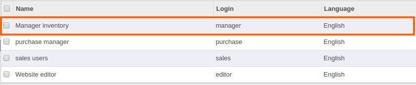
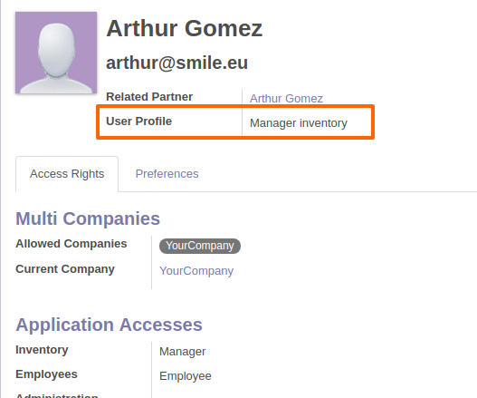
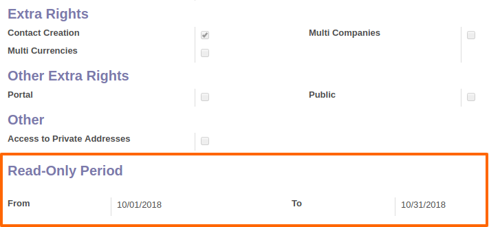
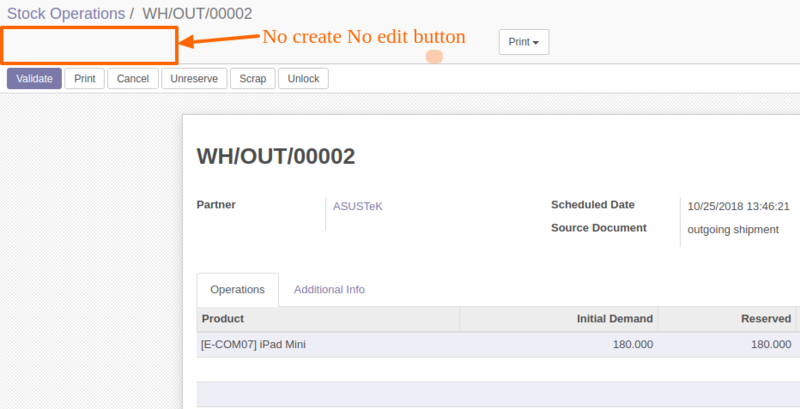

.. image:: https://img.shields.io/badge/licence-AGPL--3-blue.svg
    :alt: License: AGPL-3

=====================
Access Control Period
=====================

This module add possibility to restrict access rules by user profile for a given period

Features :

* The administrator creates User Profiles
* The administrator assigns profiles to users
* The administrator adds "read only period"
* The user can access to modules just with read privilege in this period

**Table of contents**

.. contents::
   :local:

Usage
=====
To add User Profiles :

1. Go to ``Settings > Users & Companies``> User Profiles menu.
2. Create new User Profiles

3. Go to users > choose one > assign the user profile to user

4. Determine the period of read only

5. When the user goes to create or edit something, he cannot (no create button, no edit button) :

6. Also when he goes to click validate button, a Access error message will pop up :

.. figure:: static/description/raise.png
   :alt: raise message
   :width: 100%

Bug Tracker
===========

Bugs are tracked on `GitHub Issues <https://github.com/Smile-SA/odoo_addons/issues>`_.
In case of trouble, please check there if your issue has already been reported.
If you spotted it first, help us smashing it by providing a detailed and welcomed feedback
`here <https://github.com/Smile-SA/odoo_addons/issues/new?body=module:%20smile_access_control%0Aversion:%2011.0%0A%0A**Steps%20to%20reproduce**%0A-%20...%0A%0A**Current%20behavior**%0A%0A**Expected%20behavior**>`_.

Do not contact contributors directly about support or help with technical issues.

GDPR / EU Privacy
=================
This addons does not collect any data and does not set any browser cookies.

Credits
=======

Authors
-------

Smile SA

Maintainer
----------
This module is maintained by the Smile SA.

Since 1991 Smile has been a pioneer of technology and also the European expert in open source solutions.

.. image:: https://avatars0.githubusercontent.com/u/572339?s=200&v=4
   :alt: Smile SA
   :target: http://smile.fr

This module is part of the `odoo-addons <https://github.com/Smile-SA/odoo_addons>`_ project on GitHub.

You are welcome to contribute.

