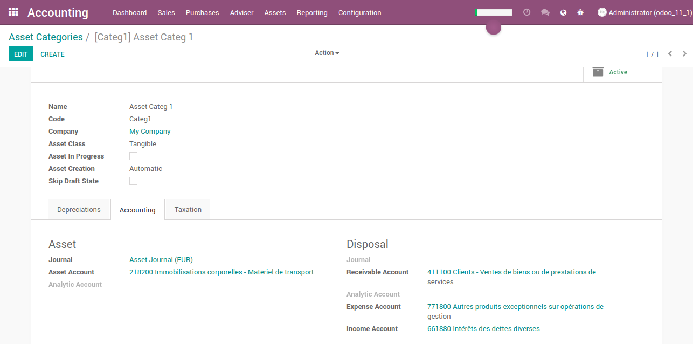
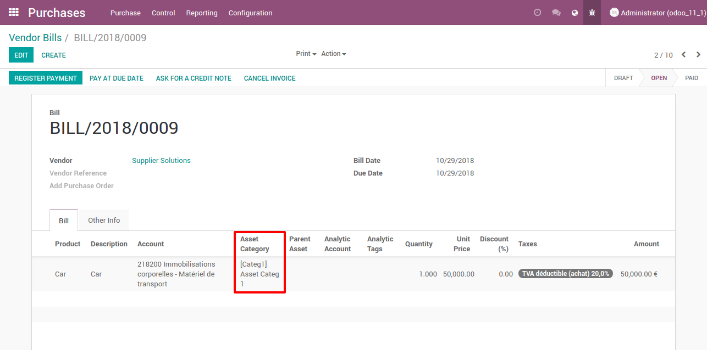
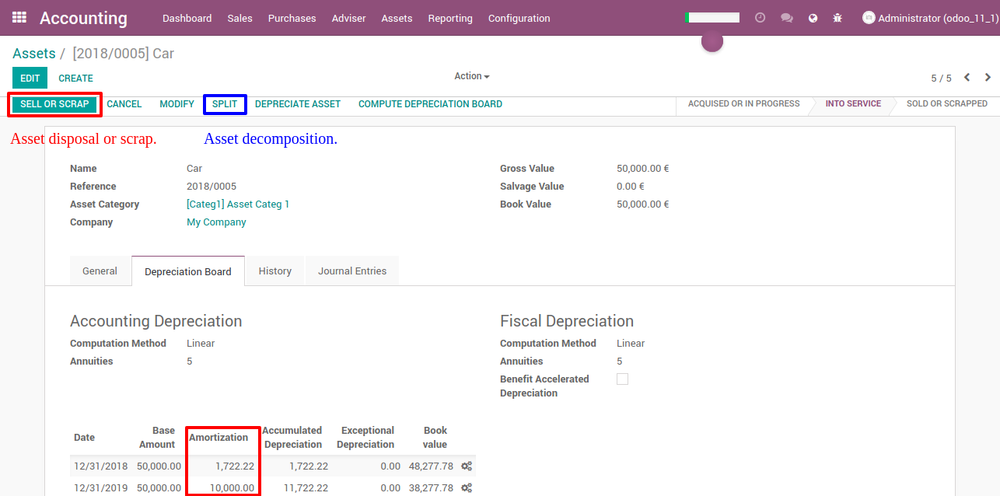

===========================
Accounting Asset Management
===========================

.. |badge2| image:: https://img.shields.io/badge/licence-AGPL--3-blue.png
    :target: http://www.gnu.org/licenses/agpl-3.0-standalone.html
    :alt: License: AGPL-3
.. |badge3| image:: https://img.shields.io/badge/github-Smile_SA%2Fodoo_addons-lightgray.png?logo=github
    :target: https://github.com/Smile-SA/odoo_addons/tree/11.0/smile_account_asset
    :alt: Smile-SA/odoo_addons

|badge2| |badge3|

This module allows to manage:
    * Assets and categories
    * Amortization (ie periodic depreciation) and depreciation (exceptional)
    * Accounting and fiscal depreciation methods
    * Assets sale/scrapping
    * Out of heritage
    * Asset decomposition
    * Asset modification
    * Reporting
    * Transfer depreciation in amortization (French law)

**WARNING:**
This module is not compatible with account_asset, so uninstall it before installing this one.

**Table of contents**

.. contents::
   :local:

Configuration
=============

To see full menus of asset management, please add group "Show Full Accounting Features" to your user.

Usage
=====

**Asset category configuration**

**Asset from invoice**

**Asset**

Financial reporting
===================

The following part is described in French, as this is only available for France.

Cinq rapports ont été implémentés :

* Bilan :
    * Retourne les immobilisations :
        * acquises définitivement antérieurement à la date de fin
        * non cédée à la date de fin ou cédée depuis le début de l'exercice  fiscal courant à la date de fin
* Plus ou moins-values fiscales :
    * Retourne les immobilisations cédées au cours de la période
* Situation des dotations :
    * Retourne les immobilisations en service sur la période du rapport
* Déductions fiscales :
    * Retourne les immobilisations bénéficiant d'une déduction fiscale en service à la date de fin ou cédée dans l'exercice de la date de fin
* Immobilisations en cours :
    * Retourne les lignes de facture associées à
        * une immobilisation en cours à la date de fin
        * aucune immobilisation mais liée à une catégorie d'immobilisation en cours

Bug Tracker
===========

Bugs are tracked on `GitHub Issues <https://github.com/Smile-SA/odoo_addons/issues>`_.
In case of trouble, please check there if your issue has already been reported.
If you spotted it first, help us smashing it by providing a detailed and welcomed
`feedback <https://github.com/Smile-SA/odoo_addons/issues/new?body=module:%20smile_account_asset%0Aversion:%2011.0%0A%0A**Steps%20to%20reproduce**%0A-%20...%0A%0A**Current%20behavior**%0A%0A**Expected%20behavior**>`_.

Do not contact contributors directly about support or help with technical issues.

Credits
=======

Authors
~~~~~~~

* Smile SA

Contributors
~~~~~~~~~~~~

* Corentin Pouhet-Brunerie

Maintainers
~~~~~~~~~~~

This module is maintained by the Smile SA.

Since 1991 Smile has been a pioneer of technology and also the European expert in open source solutions.

.. image:: https://avatars0.githubusercontent.com/u/572339?s=200&v=4
   :alt: Smile SA
   :target: http://smile.fr

This module is part of the `odoo-addons <https://github.com/Smile-SA/odoo_addons>`_ project on GitHub.

You are welcome to contribute.
