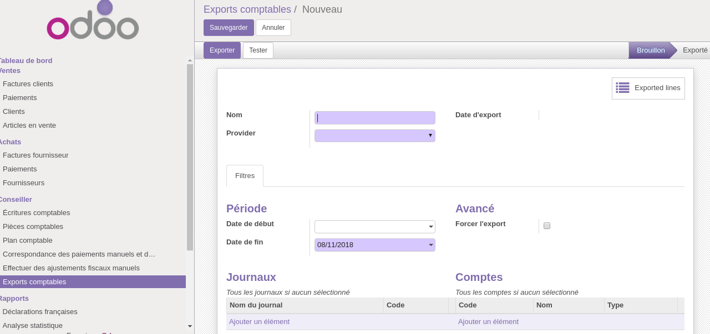
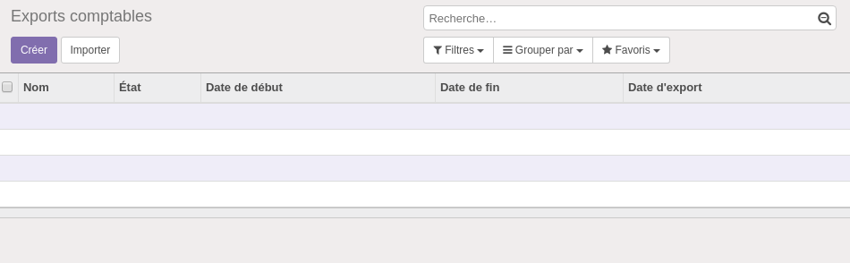

.. |badge1| image:: https://img.shields.io/badge/licence-GPL--3-blue.svg
    :alt: License: GPL-3

.. |badge2| image:: https://img.shields.io/badge/github-Smile--SA%2Fodoo_addons-lightgray.png?logo=github
    :target: https://git.smile.fr/erp/odoo_addons/tree/10.0/smile_account_export
    :alt: Smile-SA/odoo_addons

|badge1| |badge2|

Account Export
====================

This module allows you to export accounting entries relatif to a provider, accounting journals, accounting accounts, and to log exports in order to be able to execute them again later.

Installation
============

It is necessary to install the module account_accountant to be able to display the menus

Usage
=====

Once installed, the module adds a new menu on Accounting > Adviser > Account Exports.

From here you can create a new export.

You will be prompted the following form:

Only the provider and the export end date are required,but it is possible to refine the search by adding an accounting journal or an accounting account.

There is also a preview of the lines already exported from this model.

Screenshots
===========

**Tree view**

Known Issues
============
---

Bug Tracker
===========

Bugs are tracked on `GitHub Issues <https://github.com/Smile-SA/odoo_addons/issues>`_.
In case of trouble, please check there if your issue has already been reported.
If you spotted it first, help us smashing it by providing a detailed and welcomed feedback
`here <https://github.com/Smile-SA/odoo_addons/issues/new?body=module:%20smile_checkbook%0Aversion:%2010.0%0A%0A**Steps%20to%20reproduce**%0A-%20...%0A%0A**Current%20behavior**%0A%0A**Expected%20behavior**>`_.

Credits
=======

Contributors
------------

* Isabelle RICHARD

Maintainer
----------

This module is maintained by Smile SA.

Since 1991 Smile has been a pioneer of technology and also the European expert in open source solutions.