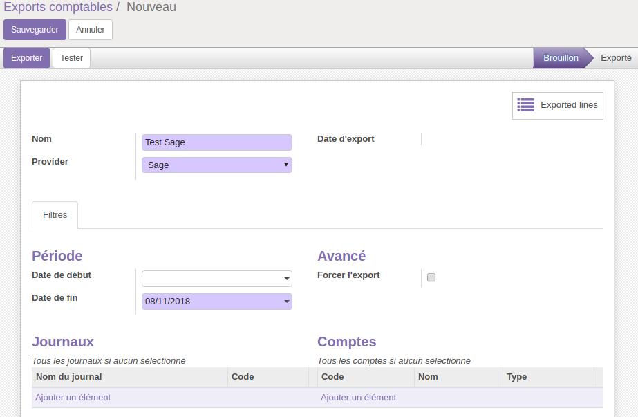
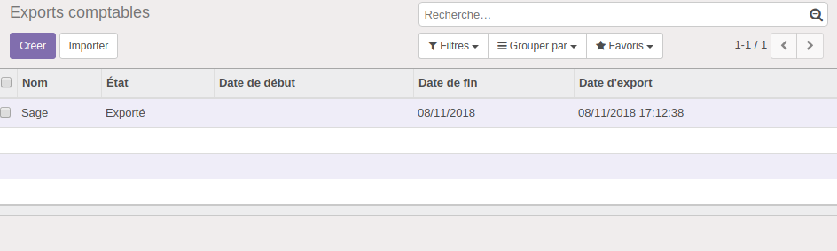

.. |badge1| image:: https://img.shields.io/badge/licence-AGPL--3-blue.svg
    :alt: License: AGPL-3

.. |badge2| image:: https://img.shields.io/badge/github-Smile--SA%2Fodoo_addons-lightgray.png?logo=github
    :target: https://github.com/Smile-SA/odoo_addons/tree/10.0/smile_account_export_sage
    :alt: Smile-SA/odoo_addons

|badge1| |badge2|

Account Export Sage
====================

It is based on the behavior of the smile_account_export module, and adds Sage as a provider

It therefore offers the possibility to filter on Sage's specific records

Installation
============

This module requires the smile_account_export module to work.

Usage
=====

Once installed, the module Adds Sage to provider.

From here you can create a new export with Sage as provider, and filter on its move lines.

You will be prompted the following form:

The module generates an export txt file, as an attachment to the form.

Example :

FAC	08/11/2018	FACT.sage	411100	sage	FAC/2018/0001	FAC/2018/0001	08/11/2018	120.00	0.00

FAC	08/11/2018	FACT.sage	445711	sage	FAC/2018/0001	FAC/2018/0001	08/11/2018	0.00	20.00

FAC	08/11/2018	FACT.sage	707100	sage	FAC/2018/0001	FAC/2018/0001	08/11/2018	0.00	100.00

Screenshots
===========

**Tree view**

Bug Tracker
===========

Bugs are tracked on `GitHub Issues <https://github.com/Smile-SA/odoo_addons/issues>`_.
In case of trouble, please check there if your issue has already been reported.
If you spotted it first, help us smashing it by providing a detailed and welcomed feedback
`here <https://github.com/Smile-SA/odoo_addons/issues/new?body=module:%20smile_checkbook%0Aversion:%2010.0%0A%0A**Steps%20to%20reproduce**%0A-%20...%0A%0A**Current%20behavior**%0A%0A**Expected%20behavior**>`_.

Credits
=======

Contributors
------------

* Corentin POUHET-BRUNERIE

Maintainer
----------

This module is maintained by Smile SA.

Since 1991 Smile has been a pioneer of technology and also the European expert in open source solutions.
