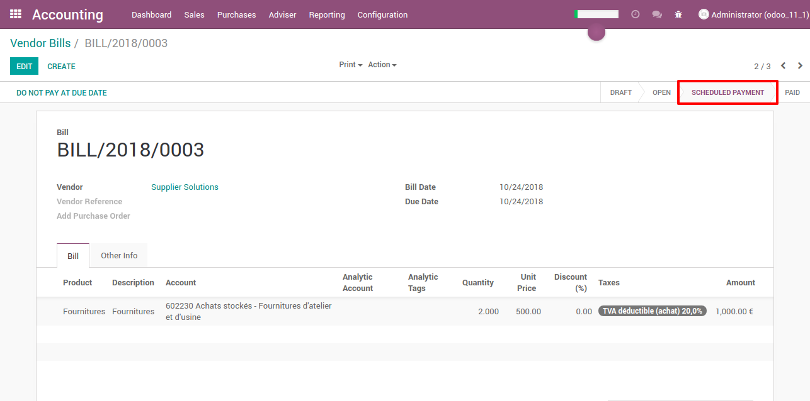
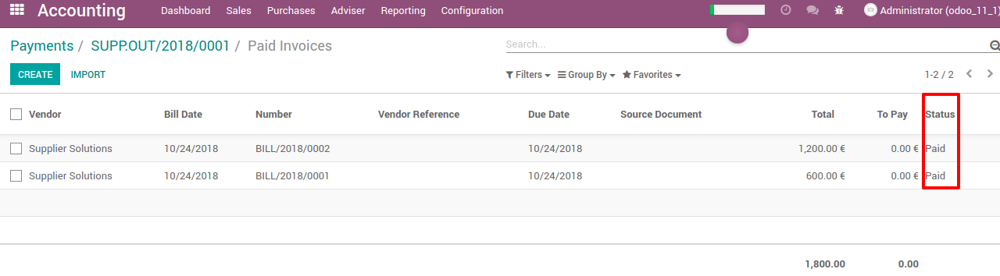

==============================
Auto pay suppliers at due date
==============================

.. |badge2| image:: https://img.shields.io/badge/licence-AGPL--3-blue.png
    :target: http://www.gnu.org/licenses/agpl-3.0-standalone.html
    :alt: License: AGPL-3
.. |badge3| image:: https://img.shields.io/badge/github-Smile_SA%2Fodoo_addons-lightgray.png?logo=github
    :target: https://github.com/Smile-SA/odoo_addons/tree/11.0/smile_account_payment_auto
    :alt: Smile-SA/odoo_addons

|badge2| |badge3|

This module allows to pay supplier invoices automatically when they come to the due date.

The payment could be individual or grouped.

**Table of contents**

.. contents::
   :local:

Usage
=====

1. Define payment mode on suppliers
    * individual: invoice one by one
    * grouped: all invoices with a same due date

.. figure:: static/description/supplier.png
   :alt: supplier
   :width: 100%

2. Indicate invoices to pay

3. A scheduled action, generate payments at the due date

Bug Tracker
===========

Bugs are tracked on `GitHub Issues <https://github.com/Smile-SA/odoo_addons/issues>`_.
In case of trouble, please check there if your issue has already been reported.
If you spotted it first, help us smashing it by providing a detailed and welcomed
`feedback <https://github.com/Smile-SA/odoo_addons/issues/new?body=module:%20smile_account_payment_auto%0Aversion:%2011.0%0A%0A**Steps%20to%20reproduce**%0A-%20...%0A%0A**Current%20behavior**%0A%0A**Expected%20behavior**>`_.

Do not contact contributors directly about support or help with technical issues.

Credits
=======

Authors
~~~~~~~

* Smile SA

Contributors
~~~~~~~~~~~~

* Corentin Pouhet-Brunerie

Maintainers
~~~~~~~~~~~

This module is maintained by the Smile SA.

Since 1991 Smile has been a pioneer of technology and also the European expert in open source solutions.

.. image:: https://avatars0.githubusercontent.com/u/572339?s=200&v=4
   :alt: Smile SA
   :target: http://smile.fr

This module is part of the `odoo-addons <https://github.com/Smile-SA/odoo_addons>`_ project on GitHub.

You are welcome to contribute.
