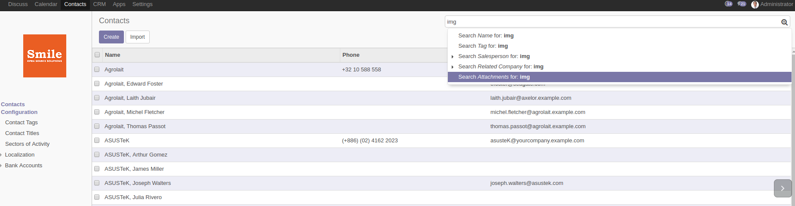
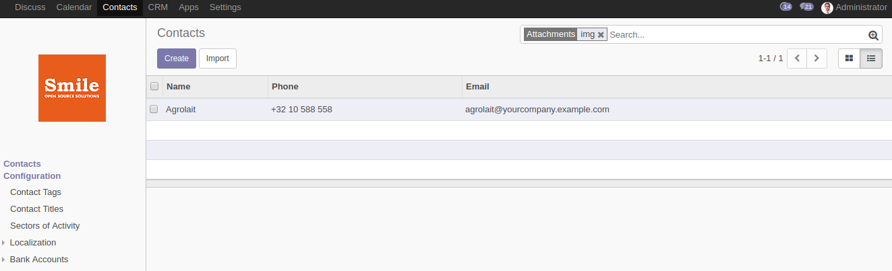
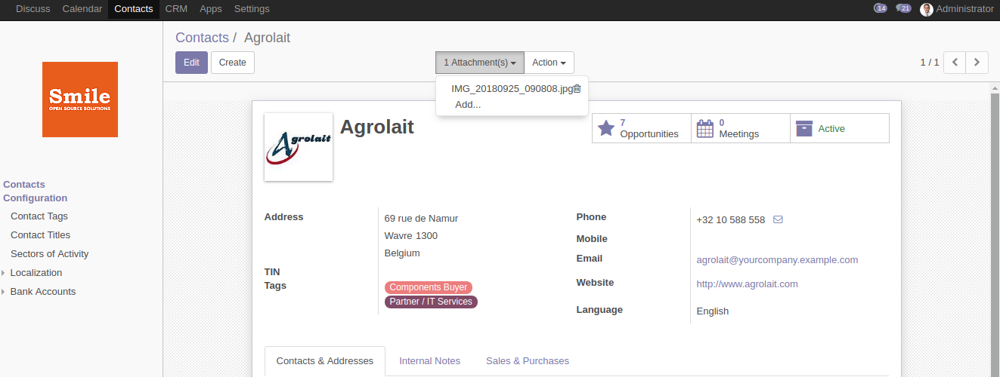

=====================
Search in Attachments
=====================

.. |badge2| image:: https://img.shields.io/badge/licence-AGPL--3-blue.png
    :target: http://www.gnu.org/licenses/agpl-3.0-standalone.html
    :alt: License: AGPL-3
.. |badge3| image:: https://img.shields.io/badge/github-Smile_SA%2Fodoo_addons-lightgray.png?logo=github
    :target: https://github.com/Smile-SA/odoo_addons/tree/14.0/smile_attachment
    :alt: Smile-SA/odoo_addons

|badge2| |badge3|

This module allows to search in attachments (for all models). It allows you to search, in addition to the file name, on the indexed content of .docx, .xlsx, .pptx, .odt, .ods documents.

Features:

* Users can search in attachments from the search bar of the current model.
* Users can search by using a keyword from the name or the content of attachments.

**Table of contents**

.. contents::
   :local:

Usage
=====

If you have a document inserted in your model, and you want to search for it:

#. Go to the ``Search bar``;
#. Type a keyword from the document's name or content;
#. Select ``Search Attachments for:``;
#. The record containing the document will be displayed.

Bug Tracker
===========

Bugs are tracked on `GitHub Issues <https://github.com/Smile-SA/odoo_addons/issues>`_.
In case of trouble, please check there if your issue has already been reported.
If you spotted it first, help us smashing it by providing a detailed and welcomed feedback
`here <https://github.com/Smile-SA/odoo_addons/issues/new?body=module:%20smile_attachment%0Aversion:%2014.0%0A%0A**Steps%20to%20reproduce**%0A-%20...%0A%0A**Current%20behavior**%0A%0A**Expected%20behavior**>`_.

Do not contact contributors directly about support or help with technical issues.

GDPR / EU Privacy
=================

This addons does not collect any data and does not set any browser cookies.

Credits
=======

Contributors
------------

* Corentin POUHET-BRUNERIE

Maintainer
----------

This module is maintained by Smile SA.

Since 1991 Smile has been a pioneer of technology and also the European expert in open source solutions.

.. image:: https://avatars0.githubusercontent.com/u/572339?s=200&v=4
   :alt: Smile SA
   :target: http://smile.fr

This module is part of the `odoo-addons <https://github.com/Smile-SA/odoo_addons>`_ project on GitHub.

You are welcome to contribute.
