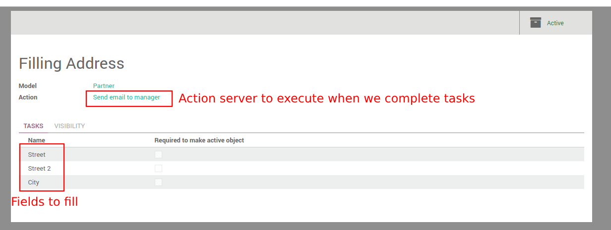
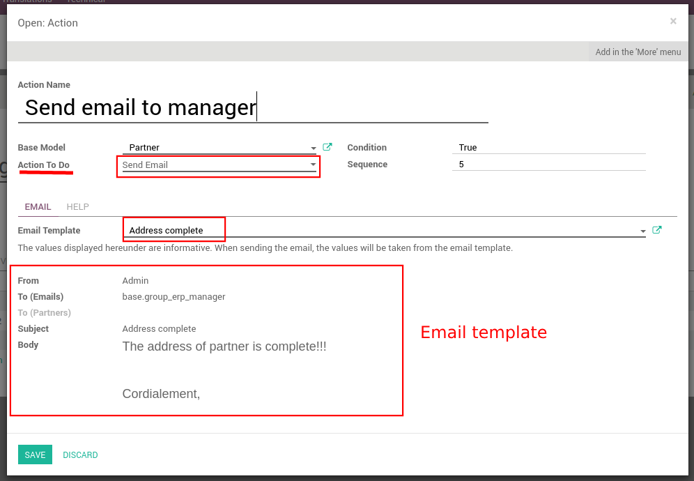
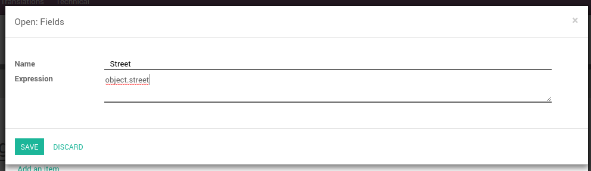
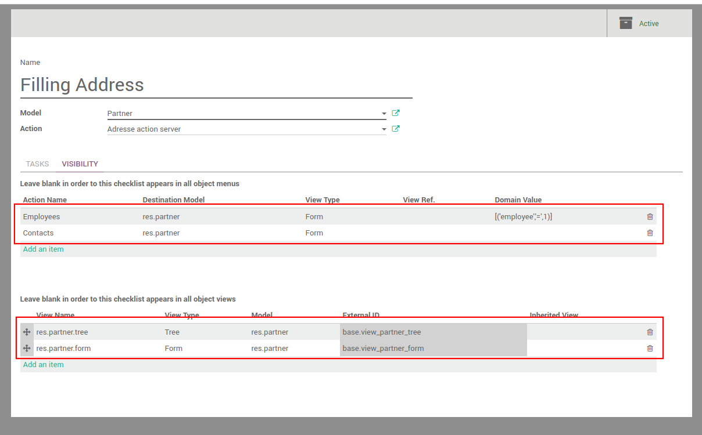
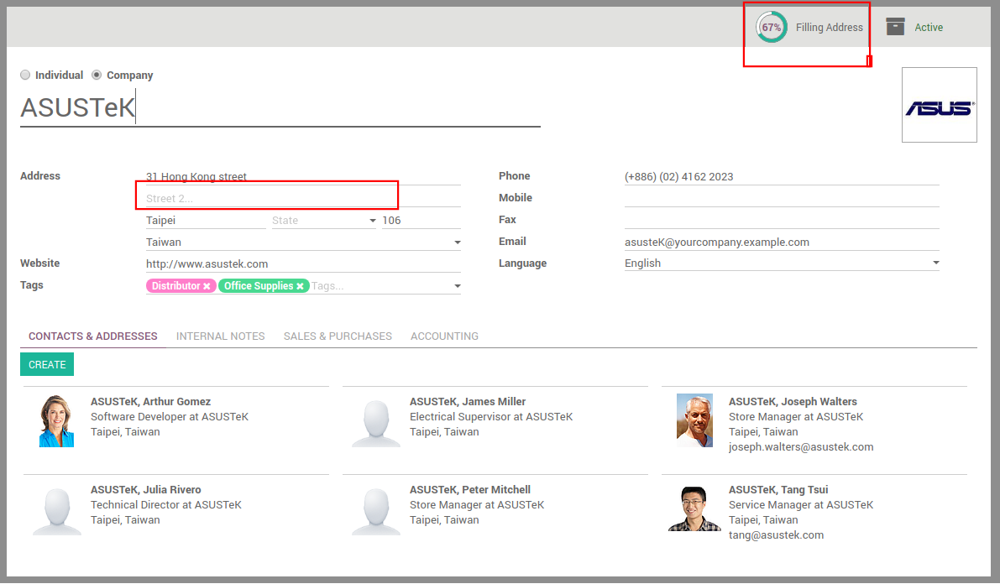
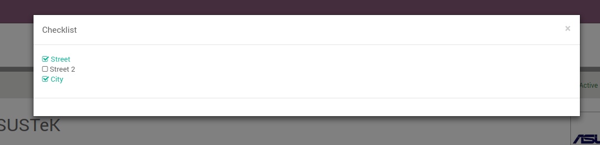
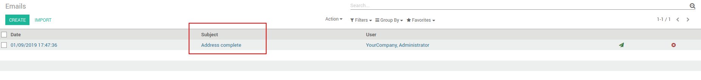
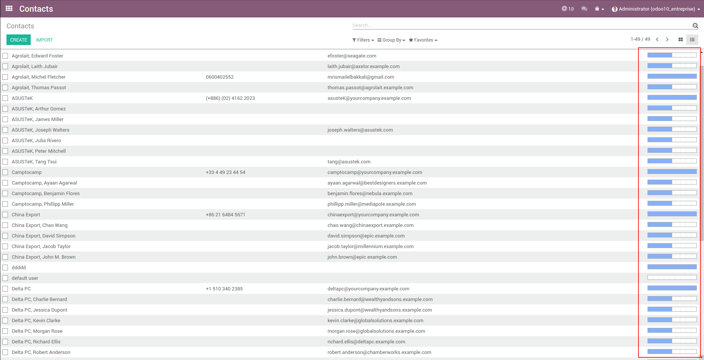

================
Smile Checklist
================

.. |badge2| image:: https://img.shields.io/badge/licence-AGPL--3-blue.png
    :target: http://www.gnu.org/licenses/agpl-3.0-standalone.html
    :alt: License: AGPL-3
.. |badge3| image:: https://img.shields.io/badge/github-Smile_SA%2Fodoo_addons-lightgray.png?logo=github
    :target: https://github.com/Smile-SA/odoo_addons/tree/10.0/smile_checklist
    :alt: Smile-SA/odoo_addons

|badge2| |badge3|

This module allows to Add checklist to forms to track their filling progress and add actions to be triggered once their checklist is fully completed.

A checklist applies to a single object and is composed of:

1. Tasks
        * List of fields to fill or boolean expressions to respect
        * Server Action executed if the task is completed

2. Views on which the checklist is visible
3. Server Action executed if the checklist is completed
        * all action types: email, sms, object creation/update, etc

**Table of contents**

.. contents::
   :local:

Usage
=====

In our example we will create a checklist to check if the contacts address is completed, once we complete it! A server action will send an email automatically to manager

* Go to new menu **Settings > Technical > Checklists** and create a new checklist:

We select the action that will execute, when we complete the checklist:

To create a task, we should write in expression "object.field_name" :

We choose the views and menus that the checklist appears in:

We can see the average checklist, in the form view that we specified:

By clicking on the smart button, we see a wizard contains our checklist fields:

Once we complete the checklist, the server sends the email:

We can see also the average in the list view that we added, in visibility options:

Known issues
============

Need to restart server to display checklist on model's views after creation.

Bug Tracker
===========

Bugs are tracked on `GitHub Issues <https://github.com/Smile-SA/odoo_addons/issues>`_.
In case of trouble, please check there if your issue has already been reported.
If you spotted it first, help us smashing it by providing a detailed and welcomed
`feedback <https://github.com/Smile-SA/odoo_addons/issues/new?body=module:%20smile_checklist%0Aversion:%2010.0%0A%0A**Steps%20to%20reproduce**%0A-%20...%0A%0A**Current%20behavior**%0A%0A**Expected%20behavior**>`_.

Do not contact contributors directly about support or help with technical issues.

GDPR / EU Privacy
=================

This addons does not collect any data and does not set any browser cookies.

Credits
=======

Authors
~~~~~~~

* Smile SA

Contributors
~~~~~~~~~~~~

* Corentin Pouhet-Brunerie

Maintainers
~~~~~~~~~~~

This module is maintained by the Smile SA.

Since 1991 Smile has been a pioneer of technology and also the European expert in open source solutions.

.. image:: https://avatars0.githubusercontent.com/u/572339?s=200&v=4
   :alt: Smile SA
   :target: http://smile.fr

This module is part of the `odoo-addons <https://github.com/Smile-SA/odoo_addons>`_ project on GitHub.

You are welcome to contribute.