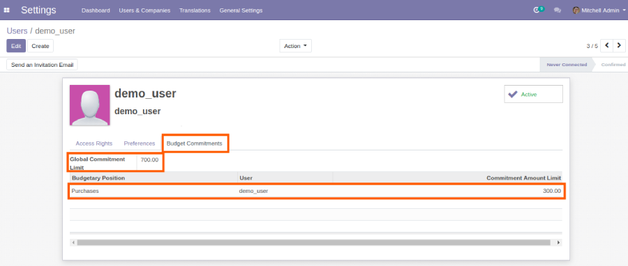
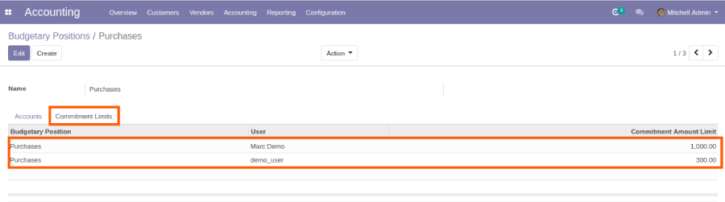

=========================
Account Budget Commitment
=========================

.. |badge2| image:: https://img.shields.io/badge/licence-AGPL--3-blue.png
    :target: http://www.gnu.org/licenses/agpl-3.0-standalone.html
    :alt: License: AGPL-3
.. |badge3| image:: https://img.shields.io/badge/github-Smile_SA%2Fodoo_addons-lightgray.png?logo=github
    :target: https://github.com/Smile-SA/odoo_addons/tree/11.0/smile_commitment_base
    :alt: Smile-SA/odoo_addons

|badge2| |badge3|

Since Odoo 9.0, it's not possible anymore to set a general account on analytic lines.

This module adds a commitment account on analytic line.

A new commitment type is defined on analytic line: purchase, sale or payroll.

This module enables commitment budget limits by user:

- global limit
- limit by budgetary position

**Table of contents**

.. contents::
   :local:

Usage
=====

**set commitment budget limits from user form**

**set commitment budget limits from budgetary position form**

To follow purchase commitment, please install
`smile_commitment_purchase <https://github.com/Smile-SA/odoo_addons/tree/11.0/smile_commitment_purchase>`_
.

Changelog
=========

**To do:**

Add tolerance percentage or fixed amount for over budget commitment

Bug Tracker
===========

Bugs are tracked on `GitHub Issues <https://github.com/Smile-SA/odoo_addons/issues>`_.
In case of trouble, please check there if your issue has already been reported.
If you spotted it first, help us smashing it by providing a detailed and welcomed feedback
`here <https://github.com/Smile-SA/odoo_addons/issues/new?body=module:%20smile_commitment_base%0Aversion:%2011.0%0A%0A**Steps%20to%20reproduce**%0A-%20...%0A%0A**Current%20behavior**%0A%0A**Expected%20behavior**>`_.

Credits
=======

Authors
~~~~~~~

* Smile SA

Contributors
~~~~~~~~~~~~

* Corentin Pouhet-Brunerie
* Isabelle RICHARD

Maintainers
~~~~~~~~~~~

This module is maintained by the Smile SA.

Since 1991 Smile has been a pioneer of technology and also the European expert in open source solutions.

.. image:: https://avatars0.githubusercontent.com/u/572339?s=200&v=4
   :alt: Smile SA
   :target: http://smile.fr

This module is part of the `odoo-addons <https://github.com/Smile-SA/odoo_addons>`_ project on GitHub.

You are welcome to contribute.
