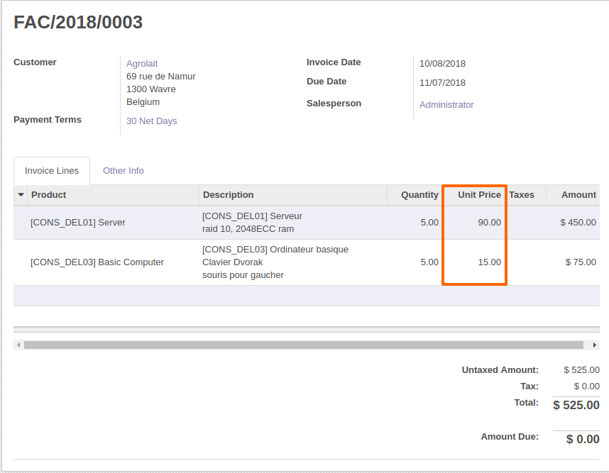
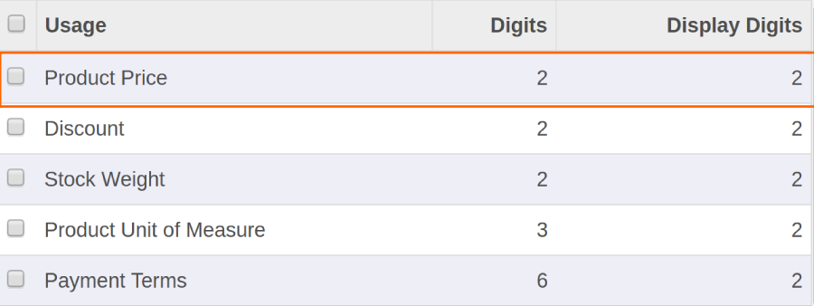
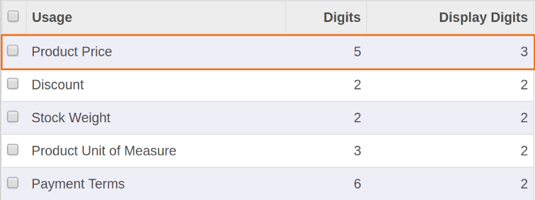
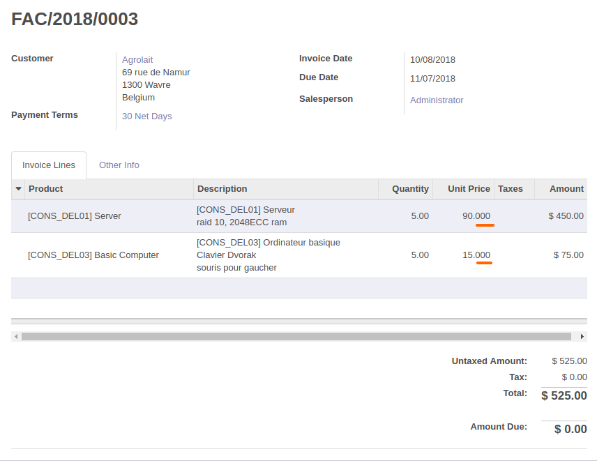

=========================
Display Decimal Precision
=========================

.. |badge2| image:: https://img.shields.io/badge/licence-AGPL--3-blue.png
    :target: http://www.gnu.org/licenses/agpl-3.0-standalone.html
    :alt: License: AGPL-3
.. |badge3| image:: https://img.shields.io/badge/github-Smile_SA%2Fodoo_addons-lightgray.png?logo=github
    :target: https://github.com/Smile-SA/odoo_addons/tree/12.0/smile_decimal_precision
    :alt: Smile-SA/odoo_addons

|badge2| |badge3|

This module allows to distinguish computation digits and display digits in decimal precision.
It is also possible to manage a number of decimal places to display on devices.

Features:

* The administrator edit the decimal precision by specifying the name of digits parameter.
* The administrator put the number of digits he want to compute.
* The administrator put the number of digits he want to display.
* By default the display digits equals the the digits calculated.
* The administrator can make the display digits superior than the the digits calculated.
* The administrator can make the display digits inferior than the the digits calculated.

**Table of contents**

.. contents::
   :local:

Usage
=====

To edit a decimal precision :

1. Choose a field that you want to edit its decimal accuracy (Ex. Product Price) :

2. Go to ``Settings > Technical > Database Structure``> Decimal accuracy menu.
3. Select Decimal accuracy corresponding to field.

4. Then edit the value of digits you want to compute, and the number of digits you want to display.

   In this example we put 3 digits to display and 5 to compute

5. Now, go back to your interface to see the new decimal accuracy :

Bug Tracker
===========

Bugs are tracked on `GitHub Issues <https://github.com/Smile-SA/odoo_addons/issues>`_.
In case of trouble, please check there if your issue has already been reported.
If you spotted it first, help us smashing it by providing a detailed and welcomed feedback
`here <https://github.com/Smile-SA/odoo_addons/issues/new?body=module:%20smile_decimal_precision%0Aversion:%2012.0%0A%0A**Steps%20to%20reproduce**%0A-%20...%0A%0A**Current%20behavior**%0A%0A**Expected%20behavior**>`_.

Do not contact contributors directly about support or help with technical issues.

GDPR / EU Privacy
=================

This addons does not collect any data and does not set any browser cookies.

Credits
=======

Contributors
------------

* Corentin POUHET-BRUNERIE
* Wafaa Jaouahar

Maintainer
----------

This module is maintained by Smile SA.

Since 1991 Smile has been a pioneer of technology and also the European expert in open source solutions.

.. image:: https://avatars0.githubusercontent.com/u/572339?s=200&v=4
   :alt: Smile SA
   :target: http://smile.fr

This module is part of the `odoo-addons <https://github.com/Smile-SA/odoo_addons>`_ project on GitHub.

You are welcome to contribute.
