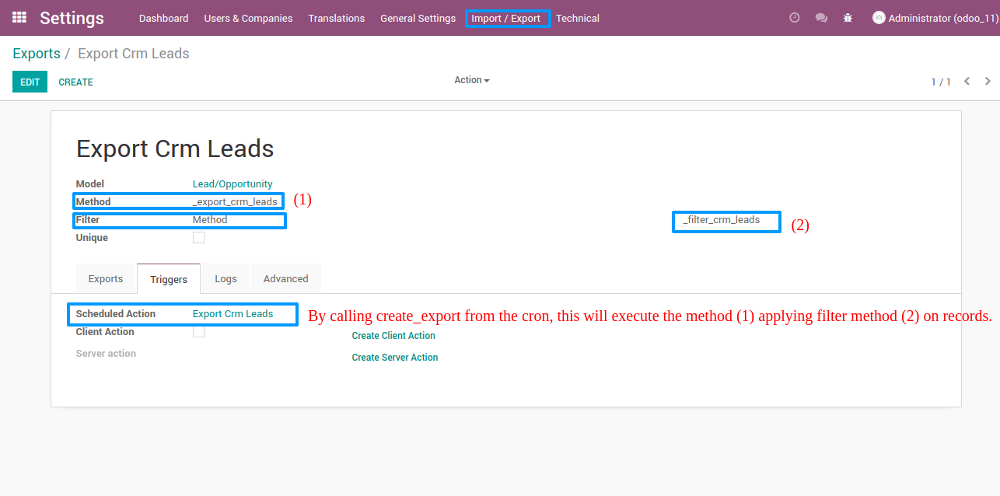
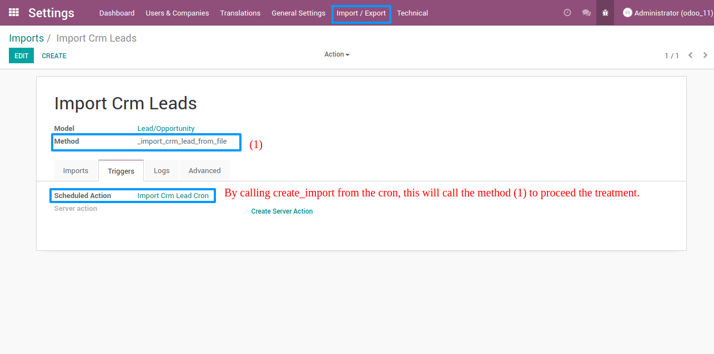

===============
Import / Export
===============

.. |badge2| image:: https://img.shields.io/badge/licence-AGPL--3-blue.png
    :target: http://www.gnu.org/licenses/agpl-3.0-standalone.html
    :alt: License: AGPL-3
.. |badge3| image:: https://img.shields.io/badge/github-Smile_SA%2Fodoo_addons-lightgray.png?logo=github
    :target: https://github.com/Smile-SA/odoo_addons/tree/11.0/smile_impex
    :alt: Smile-SA/odoo_addons

|badge2| |badge3|

This module allows to track and record logs during the execution of import/export operations.

It could be useful especially during scheduled action, so instead of checking server logs, you could get the information from interface when actions successfully done or understand the main causes when things go wrong through logs.

Features:

* Define an import/export template:
    * Choose a model
    * Define a method to import/export records
    * Define a domain to filter lines to export
* Create actions to generate a new import/export:
    * A client action to generate an export on the fly from records list
    * A scheduled action to generate periodically a new import/export
* Log execution

**Table of contents**

.. contents::
   :local:

Usage
=====

**Export Case**

**Import Case**

Case of load balancing
======================

If Odoo runs with several servers, with load balancing, you need to set the option `hostname`
inside the configuration file of each server (default: `localhost`).

If you don't set it, as PID of process created on an host is not visible by the others,
at each restart of one of the other host, the import/export process will be marked as *Killed*.

Bug Tracker
===========

Bugs are tracked on `GitHub Issues <https://github.com/Smile-SA/odoo_addons/issues>`_.
In case of trouble, please check there if your issue has already been reported.
If you spotted it first, help us smashing it by providing a detailed and welcomed
`feedback <https://github.com/Smile-SA/odoo_addons/issues/new?body=module:%20smile_impex%0Aversion:%2011.0%0A%0A**Steps%20to%20reproduce**%0A-%20...%0A%0A**Current%20behavior**%0A%0A**Expected%20behavior**>`_.

Do not contact contributors directly about support or help with technical issues.

Credits
=======

Authors
~~~~~~~

* Smile SA

Contributors
~~~~~~~~~~~~

* Corentin Pouhet-Brunerie
* Isabelle Richard

Maintainers
~~~~~~~~~~~

This module is maintained by the Smile SA.

Since 1991 Smile has been a pioneer of technology and also the European expert in open source solutions.

.. image:: https://avatars0.githubusercontent.com/u/572339?s=200&v=4
   :alt: Smile SA
   :target: http://smile.fr

This module is part of the `odoo-addons <https://github.com/Smile-SA/odoo_addons>`_ project on GitHub.

You are welcome to contribute.
