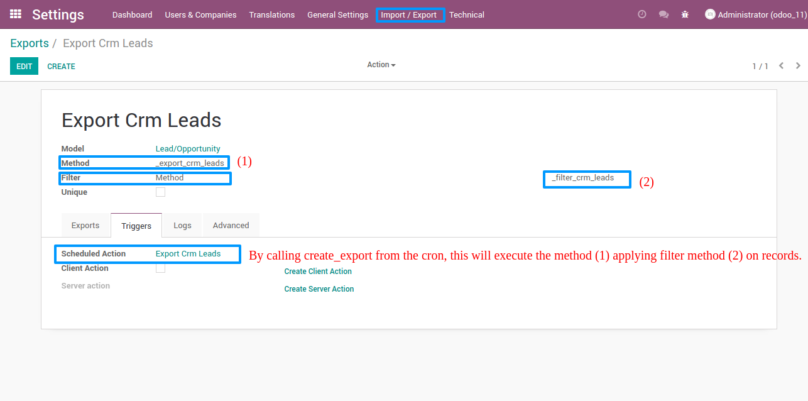

Import and export templates are reserved to administrators: all access rights of the module are granted to the group *Role / Administrator* only. This group also gives access to the execution logs.

To configure an import:

- Go to *Settings > Import / Export > Imports* and create a template.
- Fill in the name, the *Model* and the *Method* to call on that model.
- Optionally, give the method arguments as a dictionary next to the method, for example `{'code': '705000'}`.
- In the *Logs* tab, choose the log level.
- In the *Advanced* tab, check *New Thread* to run the import in the background, and *One At A Time* to prevent two runs of the same template at the same time.

To configure an export:

- Go to *Settings > Import / Export > Exports* and create a template.
- Fill in the name, the *Model* and the *Method*. This method is called on the records to export.
- Choose the *Filter*: a domain, or a method that returns the records to export.
- Check *Unique* to export each record only once across all runs.
- In the *Logs* tab, choose the log level and check *Log returns* to store the value returned by the method.
- In the *Advanced* tab, set the batch size (*Limit*), the maximum number of batches (*Max Offset*), the sort order (*Order by*), and *Force Action Execution* to call the method even when there is no record to export.

To trigger runs automatically, open the *Triggers* tab of the template:

- Click *Create Scheduled Action* to create a scheduled action, then set its frequency.
- On an export template, click *Create Client Action* to add the template to the *Action* menu of the target model's list view.
- Click *Create Server Action* to create the server action alone. *Delete Server Action* and *Delete Client Action* remove it, together with the scheduled action linked to it.

