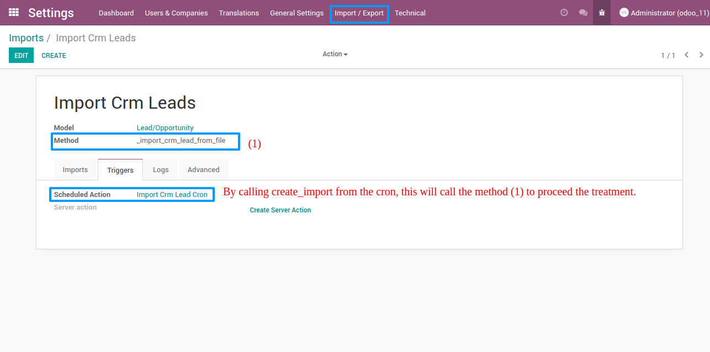

To run an import or an export by hand:

- Go to *Settings > Import / Export > Imports* or *Settings > Import / Export > Exports* and open a template.
- In the *Imports* or *Exports* tab, click *New Import* or *New Export*. The run is created at once and appears in the list with its state: running, done, exception or killed.
- Click *Test Import* or *Test Export* to run the method without keeping its changes. The run is still recorded, flagged as a test.
- Open a run to read its logs, its entry arguments and, if enabled, the value returned by the method.
- Click *Regenerate* on a run to replay it with the same arguments. For an export, the same records are exported again, which is only possible if their IDs were stored.

To export records from a list:

- On an export template with a client action, go to the list view of the target model.
- Select records, open the *Action* menu and click the template name. Only the selected records that also match the template filter are exported.

Each export creates one run per batch. When the template is set to *Unique*, records already exported by a previous run are skipped.

Two scheduled actions, *Remove old running imports* and *Remove old running exports*, run every day. They mark as *Killed* the runs that have been running for more than 24 hours and whose process no longer exists. The same cleanup happens when the module is updated.
