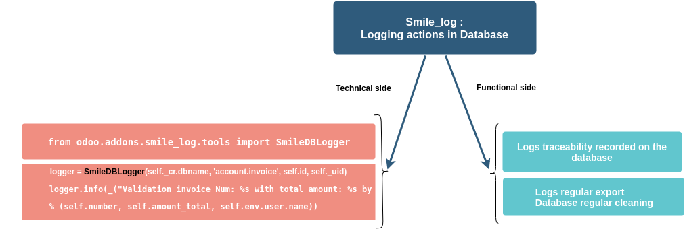
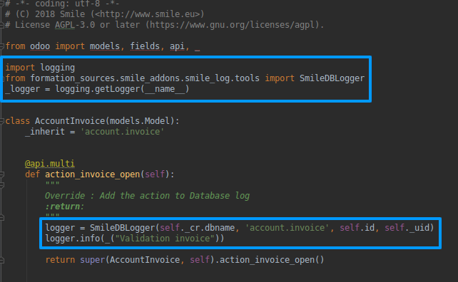
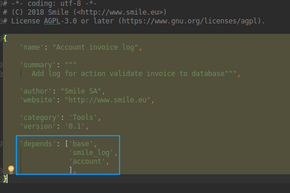
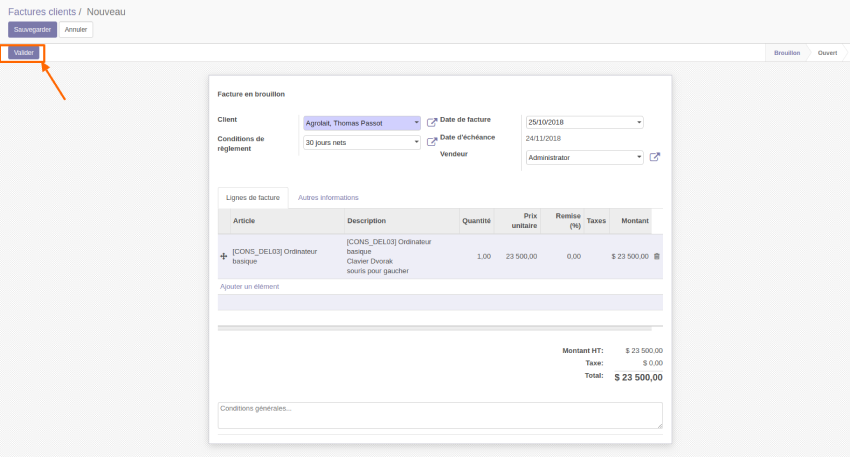
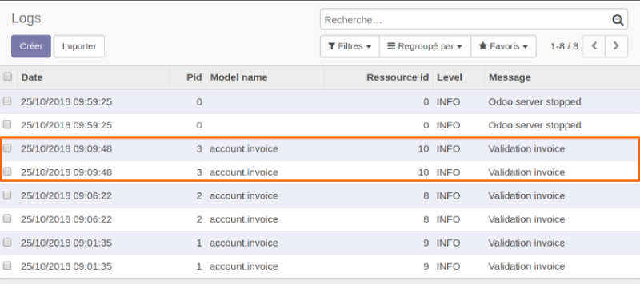
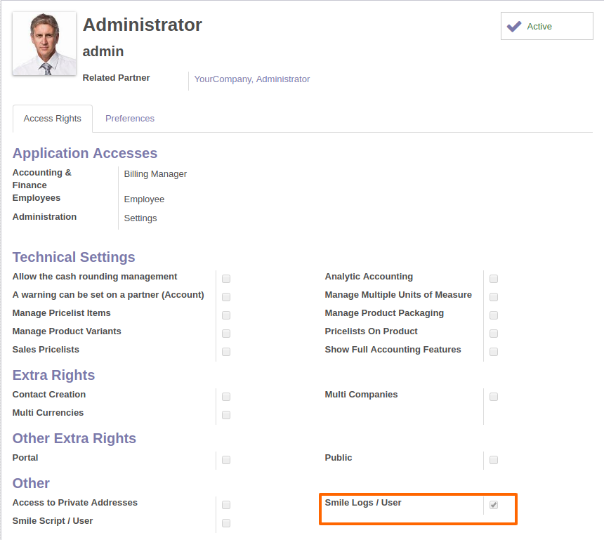

====================
Logging in database
====================

.. |badge2| image:: https://img.shields.io/badge/licence-AGPL--3-blue.png
    :target: http://www.gnu.org/licenses/agpl-3.0-standalone.html
    :alt: License: AGPL-3
.. |badge3| image:: https://img.shields.io/badge/github-Smile_SA%2Fodoo_addons-lightgray.png?logo=github
    :target: https://github.com/Smile-SA/odoo_addons/tree/11.0/smile_log
    :alt: Smile-SA/odoo_addons

|badge2| |badge3|

This module adds a logs handler writing to database.

Notice

    * Following code will create a log in db with a unique pid per logger:
        import logging
        logger = SmileLogger(dbname, model_name, res_id, uid)
        logger.info(your_message)

Features :

1. Firstly :

* The developer adds Smile Log to his model.
* The developer specifies the DB, model, res_id, uid, and the message to display.

2. Secondly :

* The administrator does the action.
* The administrator can see the logs saved in DB for the action.
* The administrator can gives access right to users, to see logs, by checking ``Smile Logs / User``.
* The administrator must create a ``Scheduled Action`` to call the function ``archive_and_delete_old_logs``, configure archiving path and the number of days to archive and delete logs.

**Table of contents**

.. contents::
   :local:

Usage
=====
To add Smile Log to an action :

1. Import SmileDBLogger to inherited action (Ex. validate button of account.invoice) :

2. Add the module to your depends in manifest :

3. Go click to your button action (button validate in our case)

4. Go to ``Settings > Technical > Logging``> Logs menu.

Administrator can give access right to users, to see logs, by checking ``Smile Logs / User``.

To create the scheduled action:
    1. Go to ``Settings > Technical > Automation > Scheduled Actions`` and fill fields as follow:

    .. figure:: static/description/scheduled_action.png
       :alt: Schedules Action
       :width: 850px

    ``(Make sure that the given folder has a write access!)``

    2. After running the action, the extracted logs file in csv format is as shown in next figure:

    .. figure:: static/description/exported_log.png
       :alt: Smile Logs
       :width: 380px

Bug Tracker
===========

Bugs are tracked on `GitHub Issues <https://github.com/Smile-SA/odoo_addons/issues>`_.
In case of trouble, please check there if your issue has already been reported.
If you spotted it first, help us smashing it by providing a detailed and welcomed feedback
`here <https://github.com/Smile-SA/odoo_addons/issues/new?body=module:%20smile_log%0Aversion:%2011.0%0A%0A**Steps%20to%20reproduce**%0A-%20...%0A%0A**Current%20behavior**%0A%0A**Expected%20behavior**>`_.

Do not contact contributors directly about support or help with technical issues.

GDPR / EU Privacy
=================
This addons does not collect any data and does not set any browser cookies.

Credits
=======

Authors
-------

* Corentin POUHET-BRUNERIE
* Xavier FERNANDEZ

Maintainer
----------
This module is maintained by the Smile SA.

Since 1991 Smile has been a pioneer of technology and also the European expert in open source solutions.

.. image:: https://avatars0.githubusercontent.com/u/572339?s=200&v=4
   :alt: Smile SA
   :target: http://smile.fr

This module is part of the `odoo-addons <https://github.com/Smile-SA/odoo_addons>`_ project on GitHub.

You are welcome to contribute.

