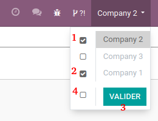

==============================
Smile Multi Company Selection
==============================

.. |badge2| image:: https://img.shields.io/badge/licence-AGPL--3-blue.png
    :target: http://www.gnu.org/licenses/agpl-3.0-standalone.html
    :alt: License: AGPL-3
.. |badge3| image:: https://img.shields.io/badge/github-Smile_SA%2Fodoo_addons-lightgray.png?logo=github
    :target: https://github.com/Smile-SA/odoo_addons/tree/13.0/smile_company_selection
    :alt: Smile-SA/odoo_addons

|badge2| |badge3|

This module allows you to choose companies from the dropdown company menu,
the page will not be reloaded until the user click on validate button.

**Table of contents**

.. contents::
   :local:

Usage
=====

**Select compagnies dropdown menu**

- 1/2: Select the companies you need, the page will not be reloaded like native behaviour
- 3: Validate your choices, and the page will be reloaded in that moment
- 4 [optional]: You can select or clear all compagnies at once

Bug Tracker
===========

Bugs are tracked on `GitHub Issues <https://github.com/Smile-SA/odoo_addons/issues>`_.
In case of trouble, please check there if your issue has already been reported.
If you spotted it first, help us smashing it by providing a detailed.

Do not contact contributors directly about support or help with technical issues.

Credits
=======

Authors
~~~~~~~

* Smile SA

Contributors
~~~~~~~~~~~~

* Rami BELGACEM

Maintainers
~~~~~~~~~~~

This module is maintained by the Smile SA.

Since 1991 Smile has been a pioneer of technology and also the European expert in open source solutions.

.. image:: https://avatars0.githubusercontent.com/u/572339?s=200&v=4
   :alt: Smile SA
   :target: http://smile.fr

This module is part of the `odoo-addons <https://github.com/Smile-SA/odoo_addons>`_ project on GitHub.

You are welcome to contribute.
