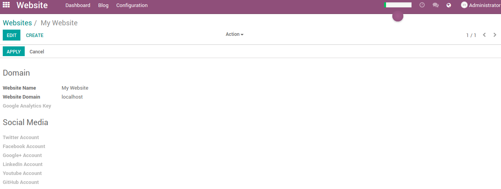

===================
Smile Multi Website
===================

.. |badge2| image:: https://img.shields.io/badge/licence-AGPL--3-blue.png
    :target: http://www.gnu.org/licenses/agpl-3.0-standalone.html
    :alt: License: AGPL-3
.. |badge3| image:: https://img.shields.io/badge/github-Smile_SA%2Fodoo_addons-lightgray.png?logo=github
    :target: https://github.com/Smile-SA/odoo_addons/tree/11.0/smile_multi_website
    :alt: Smile-SA/odoo_addons

|badge2| |badge3|

This module adds a menu to configure several websites. Multi-site works without it but it is more user-friendly.

**Table of contents**

.. contents::
   :local:

Usage
=====

**Websites Menu**

Local Configuration
===================

If you want to test the multi-site you have to use apache2 (or nginx).
Here is a little tutorial:

- install apache

sudo apt-get install apache2

* create your first site redirection

cd /etc/apache2/sites-available/

sudo nano odoo1.conf ::

    <VirtualHost *:80>
        ServerName odoo1.fr
        ServerAlias www.odoo1.fr

        ErrorLog ${APACHE_LOG_DIR}/odoo.error.log
        CustomLog ${APACHE_LOG_DIR}/odoo.access.log combined
        LogLevel warn

        ProxyRequests Off
        <Proxy *>
            Order deny,allow
            Allow from all
        </Proxy>

        ProxyPass / http://127.0.0.1:8069/
        ProxyPassReverse / http://127.0.0.1:8069/

        <Location />
            Order allow,deny
            Allow from all
        </Location>

    </VirtualHost>

* create your second site redirection

sudo nano odoo2.conf ::

    <VirtualHost *:80>
        ServerName odoo2.fr
        ServerAlias www.odoo2.fr

        ErrorLog ${APACHE_LOG_DIR}/odoo.error.log
        CustomLog ${APACHE_LOG_DIR}/odoo.access.log combined
        LogLevel warn

        ProxyRequests Off
        <Proxy *>
            Order deny,allow
            Allow from all
        </Proxy>

        ProxyPass / http://127.0.0.1:8069/
        ProxyPassReverse / http://127.0.0.1:8069/

        <Location />
            Order allow,deny
            Allow from all
        </Location>

    </VirtualHost>

- Add your configuration file on the site enable and restart apache

sudo a2ensite odoo1.conf

sudo a2ensite odoo2.conf

sudo service apache2 restart

- Add your domain on the hosts file

sudo nano /etc/hosts ::

    127.0.0.1       localhost
    127.0.0.1       odoo1.fr
    127.0.0.1       odoo2.fr

Usage
=====

Connect odoo on localhost:8069 and install the module

On the new website menu (Website/configuration/website) create two site and put your respective domain on the "domain" value.

On the page menu (hidden by default, go to dev mode), edit the Home page.

On the website list, add the localhost website if you want a unique home page for all website

Try to connect on odoo1.fr, odoo will signal that no page exist.

Just click on create page, it will not be visible for your other website.

Bug Tracker
===========

Bugs are tracked on `GitHub Issues <https://github.com/Smile-SA/odoo_addons/issues>`_.
In case of trouble, please check there if your issue has already been reported.
If you spotted it first, help us smashing it by providing a detailed and welcomed
`feedback <https://github.com/Smile-SA/odoo_addons/issues/new?body=module:%20smile_multi_website%0Aversion:%2011.0%0A%0A**Steps%20to%20reproduce**%0A-%20...%0A%0A**Current%20behavior**%0A%0A**Expected%20behavior**>`_.

Do not contact contributors directly about support or help with technical issues.

Credits
=======

Authors
~~~~~~~

* Smile SA

Contributors
~~~~~~~~~~~~

* Jonathan Dhosy

Maintainers
~~~~~~~~~~~

This module is maintained by the Smile SA.

Since 1991 Smile has been a pioneer of technology and also the European expert in open source solutions.

.. image:: https://avatars0.githubusercontent.com/u/572339?s=200&v=4
   :alt: Smile SA
   :target: http://smile.fr

This module is part of the `odoo-addons <https://github.com/Smile-SA/odoo_addons>`_ project on GitHub.

You are welcome to contribute.
