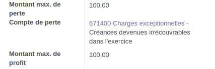
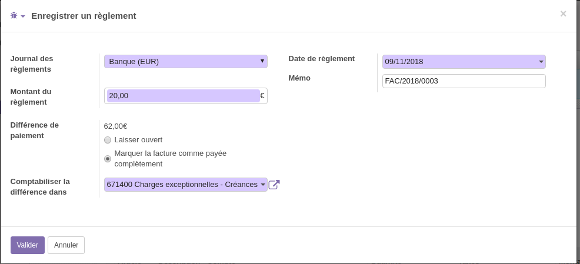
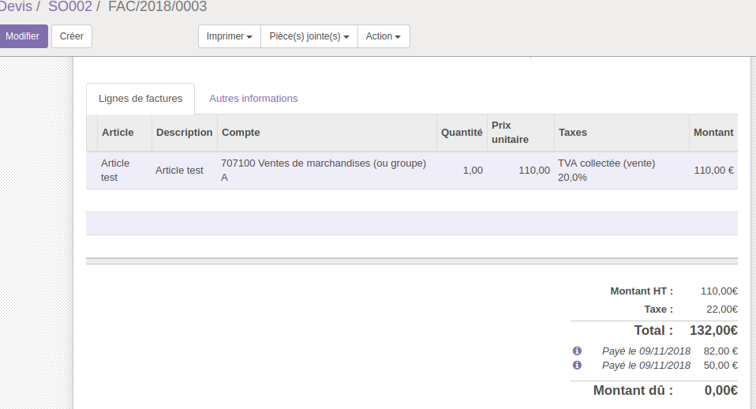

.. |badge1| image:: https://img.shields.io/badge/licence-AGPL--3-blue.svg
    :alt: License: AGPL-3

.. |badge2| image:: https://img.shields.io/badge/github-Smile--SA%2Fodoo_addons-lightgray.png?logo=github
    :target: https://github.com/Smile-SA/odoo_addons/tree/10.0/smile_payment_writeoff
    :alt: Smile-SA/odoo_addons

|badge1| |badge2|

Payment Writeoff
====================

When a payment is done, if the difference in amount, the writeoff corresponds to the loss/profit indicated on the company's form, mark invoice as fully paid with the profit/loss account

Usage
=====

Once installed, the module adds a new fields on company :

* Max Loss Amount
* Loss Account
* Max Profit Amount

When a payment is done from invoice, if writeoff is in the allowed amount, mark invoice as fully paid with the profit/loss account.

Example :

Bug Tracker
===========

Bugs are tracked on `GitHub Issues <https://github.com/Smile-SA/odoo_addons/issues>`_.
In case of trouble, please check there if your issue has already been reported.
If you spotted it first, help us smashing it by providing a detailed and welcomed feedback
`here <https://github.com/Smile-SA/odoo_addons/issues/new?body=module:%20smile_payment_writeoff%0Aversion:%2010.0%0A%0A**Steps%20to%20reproduce**%0A-%20...%0A%0A**Current%20behavior**%0A%0A**Expected%20behavior**>`_.

Credits
=======

Contributors
------------

* Isabelle RICHARD
* Corentin POUHET-BRUNERIE
* Matthieu JOOSSEN

Maintainer
----------

This module is maintained by Smile SA.

Since 1991 Smile has been a pioneer of technology and also the European expert in open source solutions.
