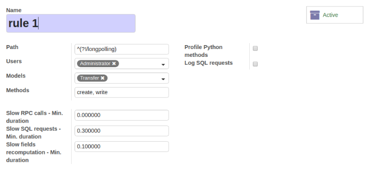
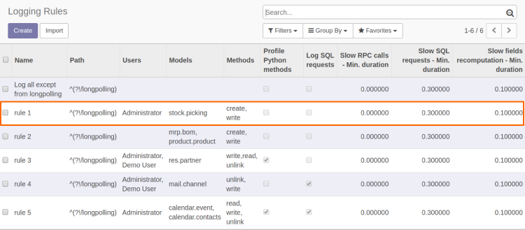
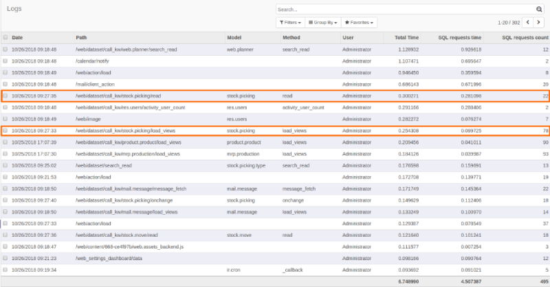

====================
Performance Analyzer
====================

.. |badge2| image:: https://img.shields.io/badge/licence-AGPL--3-blue.png
    :target: http://www.gnu.org/licenses/agpl-3.0-standalone.html
    :alt: License: AGPL-3
.. |badge3| image:: https://img.shields.io/badge/github-Smile_SA%2Fodoo_addons-lightgray.png?logo=github
    :target: https://github.com/Smile-SA/odoo_addons/tree/12.0/smile_perf_analyzer
    :alt: Smile-SA/odoo_addons

|badge2| |badge3|

Features :

This module log in function of logging rules:

* each JSON-RPC / XML-RPC call linked to a model:
  db, datetime, model, method, user, total time, db time, args, result
* Python method profiling
* SQL queries stats

A logging rule is defined directly via the user interface
(menu: Settings > Technical > Performance > Rules)
and it's applied without restarting Odoo server.

To hide the database _perf created during the installation :

* add "dbfilter = (?!.*_perf$)" in your config file.

**Table of contents**

.. contents::
   :local:

Usage
=====
To create a rule :

1. Go to ``Settings > Technical > Performance> Rules`` menu :

* In this example we will create a rule for Administrator account in sale.order module :

 We specify :

  a. Methods,

  b. Slow RPC calls - Min. duration,

  c. Slow SQL requests - Min. duration,

  d. Slow field's recomputation - Min. duration

  e. Profile Python methods,

  f. Log SQL requests

2. The rule will be added to the rules :

3. Then, when the Administrator executes one of the methods declared in the created rule, Performance Analyzer will record automatically :

* Date
* Method
* SQL requests time
* SQL requests count
* Total Time, etc

To show the Logs :

4. Go to ``Settings > Technical > Performance``> Logs menu :

Bug Tracker
===========

Bugs are tracked on `GitHub Issues <https://github.com/Smile-SA/odoo_addons/issues>`_.
In case of trouble, please check there if your issue has already been reported.
If you spotted it first, help us smashing it by providing a detailed and welcomed feedback
`here <https://github.com/Smile-SA/odoo_addons/issues/new?body=module:%20smile_perf_analyzer%0Aversion:%2012.0%0A%0A**Steps%20to%20reproduce**%0A-%20...%0A%0A**Current%20behavior**%0A%0A**Expected%20behavior**>`_.

Do not contact contributors directly about support or help with technical issues.

GDPR / EU Privacy
=================
This addons does not collect any data and does not set any browser cookies.

Credits
=======

Authors
-------

Smile SA

Contributors
------------

* Corentin POUHET-BRUNERIE
* Wafaa JAOUAHAR

Maintainer
----------
This module is maintained by the Smile SA.

Since 1991 Smile has been a pioneer of technology and also the European expert in open source solutions.

.. image:: https://avatars0.githubusercontent.com/u/572339?s=200&v=4
   :alt: Smile SA
   :target: http://smile.fr

This module is part of the `odoo-addons <https://github.com/Smile-SA/odoo_addons>`_ project on GitHub.

You are welcome to contribute.

