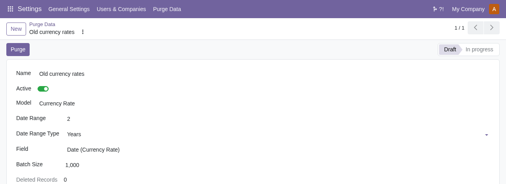

Only administrators with access to the *Settings* menu can see and edit purge rules.

To create a purge rule:

- Go to *Settings > Purge Data > Purge Data* and click *New*.
- Enter a *Name* and choose the *Model* whose records will be deleted.
- Set the retention period with *Date Range* (a positive number) and *Date Range Type*
  (*Days*, *Months* or *Years*).
- In *Field*, choose the date used to measure the age of a record. Only the date and
  datetime fields of the selected model are proposed.
- Set *Batch Size*, the number of records to delete per run (1000 by default).



A rule can be disabled with the *Active* toggle. Disabled rules are never run.

To run all active rules on a regular basis, a scheduled action is needed:

- Activate the developer mode.
- Go to *Settings > Technical > Automation > Scheduled Actions* and create a record.
- Set *Model* to *Purge Data* and choose the *Execute Every* interval.
- In the *Code* tab, enter:

  ``` python
  model.action_purge_all()
  ```

The scheduled action runs with the rights of its user, so that user must be allowed to
delete the records of every model that has a rule.
