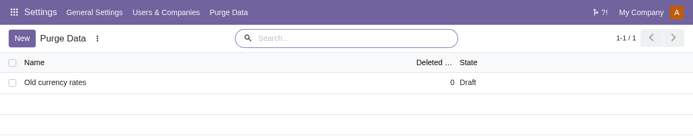

To purge old records manually:

- Go to *Settings > Purge Data > Purge Data* and open a rule.

  

- Click *Purge*.

The records of the selected model whose *Field* is older than the retention period are
deleted. A run stops after about *Batch Size* records, or when no old record is left:
click *Purge* again to continue on a large table.

After the first run, the rule moves to the *In progress* state, and *Deleted Records*
shows the total number of records deleted by the rule.

Records that cannot be deleted are skipped and the rest of the batch is still deleted. The skipped
records are listed in the server log.

If *Date Range* is not a positive number, or *Date Range Type* is empty, the purge stops
with the message "Please set a positive date range and its type."
