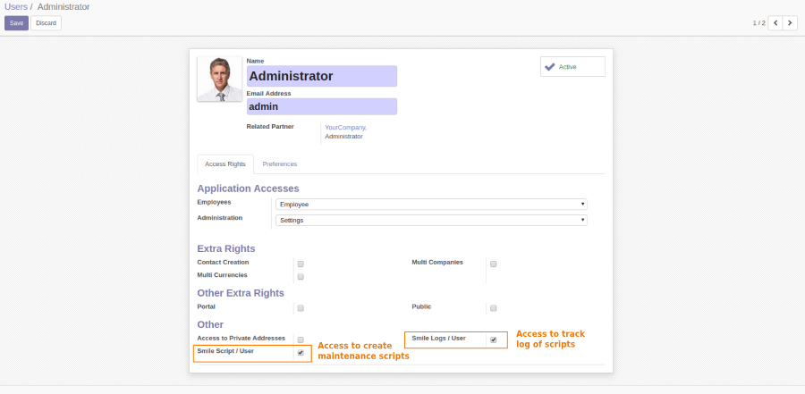
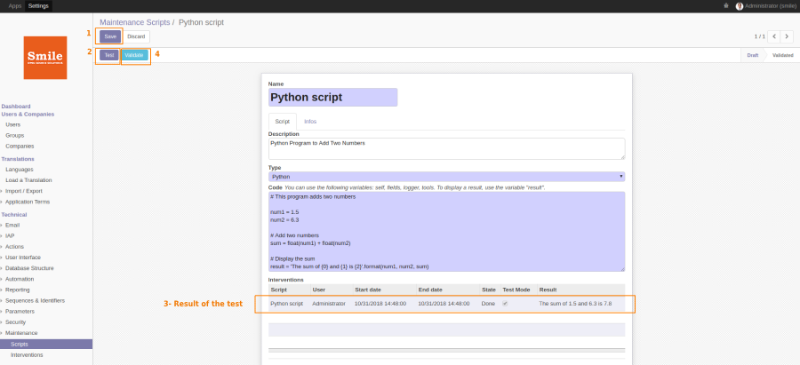
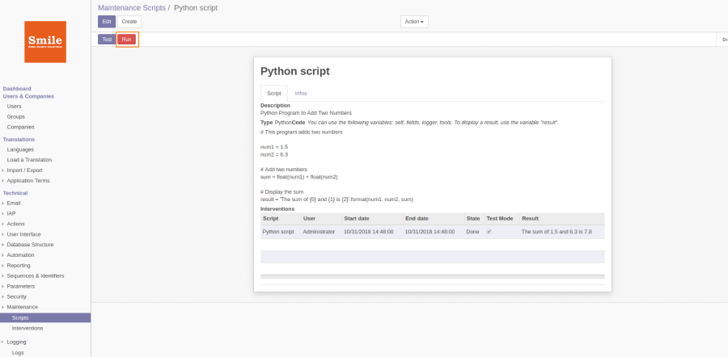
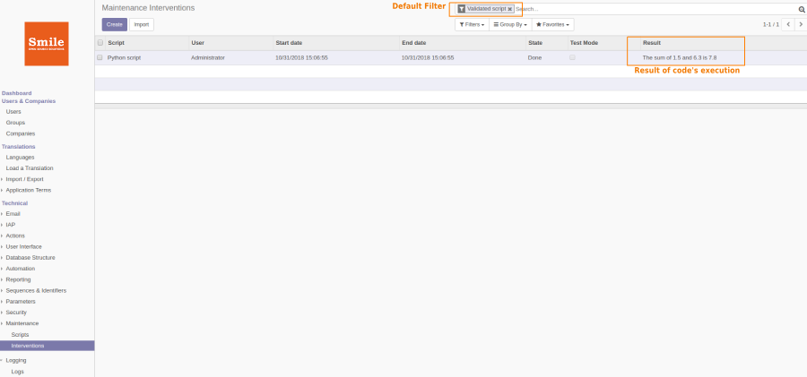
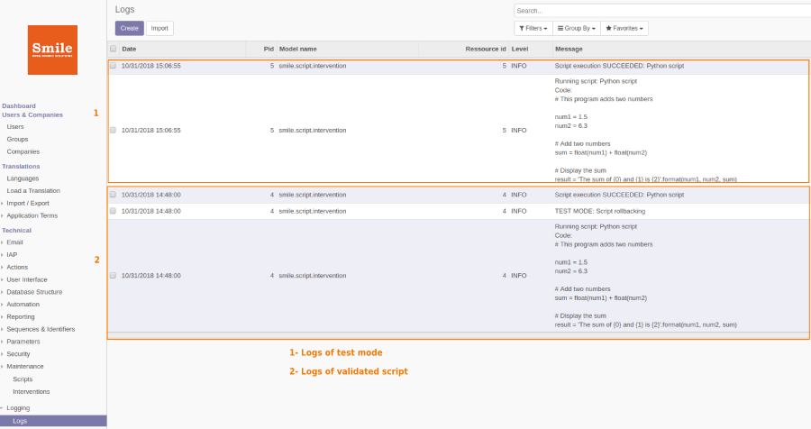

===================
Maintenance scripts
===================
.. |badge2| image:: https://img.shields.io/badge/licence-AGPL--3-blue.png
    :target: http://www.gnu.org/licenses/agpl-3.0-standalone.html
    :alt: License: AGPL-3
.. |badge3| image:: https://img.shields.io/badge/github-Smile_SA%2Fodoo_addons-lightgray.png?logo=github
    :target: https://github.com/Smile-SA/odoo_addons/tree/12.0/smile_script
    :alt: Smile-SA/odoo_addons

|badge2| |badge3|

This module allows user to create and run maintenance scripts. After each script's run, interventions will be logged in database.

Features:

* Add access right to the user by checking ``Smile Script`` and ``Smile Logs`` rights.
* Create maintenance script by specifying the name of script, description, the type (Python or SQL or XML), write the code of the script using the following variables: self, fields, logger, tools. To display a result, use the variable "result".
* Test the code and display results in intervention line with test mode checked.
* Validate a script, then run it. A new intervention will automatically be created.
* All maintenance interventions are listed in interventions menu with default filter by validated script.
* Users can track logs of maintenance interventions.
* Validated scripts and interventions can't be deleted.

**Table of contents**

.. contents::
   :local:

Usage
=====

To give access right to user to create maintenance scripts:

#. Go to ``Settings > Users & companies > Users`` menu, select the user and in ``Access Rights > Others`` check the rule ``Smile Script / User``.

To give access right to user to track logs of script's operations:

#. Go to ``Settings > Users & companies > Users`` menu, select the user and in ``Access Rights > Others`` check the rule ``Smile Logs / User``.

To create, test and validate a maintenance script:

#. Go to ``Settings > Technical > Maintenance > Scripts``, press ``Create`` button and fill the fields: Name, description, the type and the code of your script
#. Press ``Save`` and ``Test`` buttons.
#. If result is well displayed in interventions lines, press Validate button.

To execute a script and display results:

#. Press the red button ``Run``.
#. Go to ``Settings > Technical > Maintenance > Interventions``.

To track logs of maintenance interventions:

#. Go to ``Settings > Technical > Logging > Logs``.

Bug Tracker
===========

Bugs are tracked on `GitHub Issues <https://github.com/Smile-SA/odoo_addons/issues>`_.
In case of trouble, please check there if your issue has already been reported.
If you spotted it first, help us smashing it by providing a detailed and welcomed feedback
`here <https://github.com/Smile-SA/odoo_addons/issues/new?body=module:%20smile_script%0Aversion:%2012.0%0A%0A**Steps%20to%20reproduce**%0A-%20...%0A%0A**Current%20behavior**%0A%0A**Expected%20behavior**>`_.

Do not contact contributors directly about support or help with technical issues.

GDPR / EU Privacy
=================

This addons does not collect any data and does not set any browser cookies.

Credits
=======

Contributors
------------

* Corentin POUHET-BRUNERIE
* Courtois Martin

Maintainer
----------

This module is maintained by Smile SA.

Since 1991 Smile has been a pioneer of technology and also the European expert in open source solutions.

.. image:: https://avatars0.githubusercontent.com/u/572339?s=200&v=4
   :alt: Smile SA
   :target: http://smile.fr

This module is part of the `odoo-addons <https://github.com/Smile-SA/odoo_addons>`_ project on GitHub.

You are welcome to contribute.
