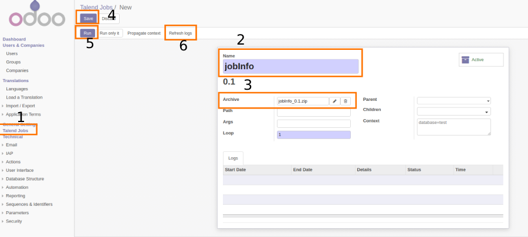
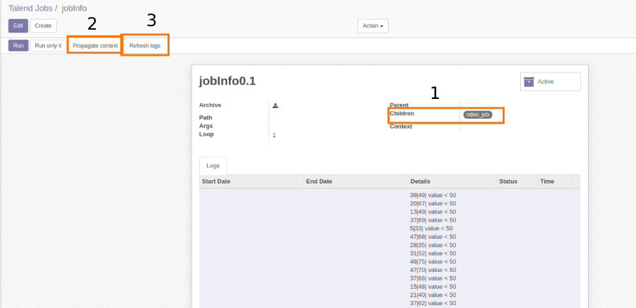
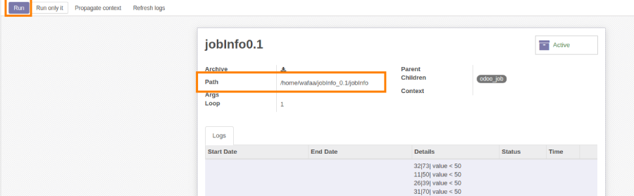
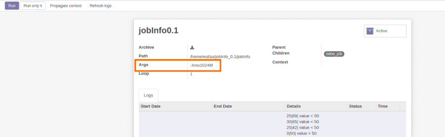
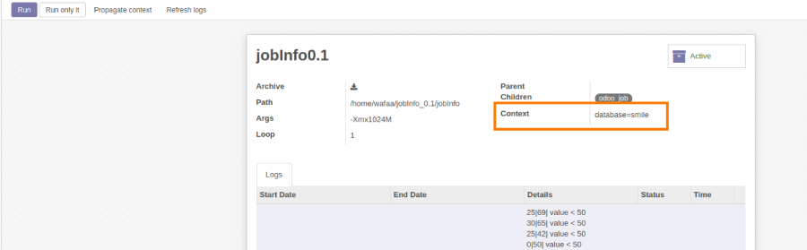

=====================
Talend Job Execution
=====================
.. |badge2| image:: https://img.shields.io/badge/licence-AGPL--3-blue.png
    :target: http://www.gnu.org/licenses/agpl-3.0-standalone.html
    :alt: License: AGPL-3
.. |badge3| image:: https://img.shields.io/badge/github-Smile_SA%2Fodoo_addons-lightgray.png?logo=github
    :target: https://github.com/Smile-SA/odoo_addons/tree/13.0/smile_talend_job
    :alt: Smile-SA/odoo_addons

|badge2| |badge3|

This module allows the execution of Talend jobs , it is useful during data integration.

Features:

* Execution of a Talend job by importing its archive .
* Visualization of the job's execution logs (creation date, end date, details, state, execution duration).
* Offers the possibility to add context variables to manage various execution types (database to use, username, password, port, host...).
* Definition of children jobs.
* Definition of the parent job.
* Passing a context environment to children jobs.
* Control the allocated memory for the job execution (by specifying the argument in the args field).
* Jobs and their executions logs storage .

**Table of contents**

.. contents::
   :local:

Usage
=====

To run a Talend job:

#. Go to ``Settings > Talend Jobs`` menu.
#. Press the button ``Create``.
#. Insert the name of the job (the name should be the same name used for the job in Talend studio ).
#. Upload the job's archive file (zip format) to ``archive field`` .
#. Click on  ``Run`` button.
#. Click on ``Refresh logs`` button.

To propagate a context environment to children jobs :

#. Add the concerned children jobs to ``Children field`` .
#. Click on ``Propagate context`` button.

Parameters you can specify  :

#. Path : to specify the path to the job's directory .
#. Args : add -Xms64M or -Xmx1024M to control the available memory for the job's execution.
#. Loop : to specify the number of times the job will be executed.
#. Parent : to indicate the parent job.
#. Children : to add children jobs.
#. Context : to specify job's context parameters.

Bug Tracker
===========

Bugs are tracked on `GitHub Issues <https://github.com/Smile-SA/odoo_addons/issues>`_.
In case of trouble, please check there if your issue has already been reported.
If you spotted it first, help us smashing it by providing a detailed and welcomed feedback
`here <https://github.com/Smile-SA/odoo_addons/issues/new?body=module:%20smile_talend_job%0Aversion:%2011.0%0A%0A**Steps%20to%20reproduce**%0A-%20...%0A%0A**Current%20behavior**%0A%0A**Expected%20behavior**>`_.

Do not contact contributors directly about support or help with technical issues.

GDPR / EU Privacy
=================

This addons does not collect any data and does not set any browser cookies.

Credits
=======

Contributors
------------

* Corentin POUHET-BRUNERIE

Maintainer
----------

This module is maintained by Smile SA.

Since 1991 Smile has been a pioneer of technology and also the European expert in open source solutions.

.. image:: https://avatars0.githubusercontent.com/u/572339?s=200&v=4
   :alt: Smile SA
   :target: http://smile.fr

This module is part of the `odoo-addons <https://github.com/Smile-SA/odoo_addons>`_ project on GitHub.

You are welcome to contribute.
