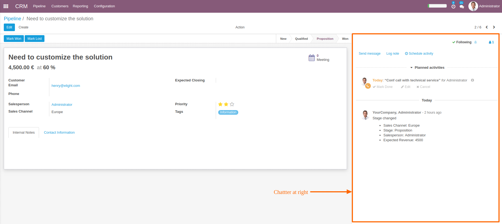
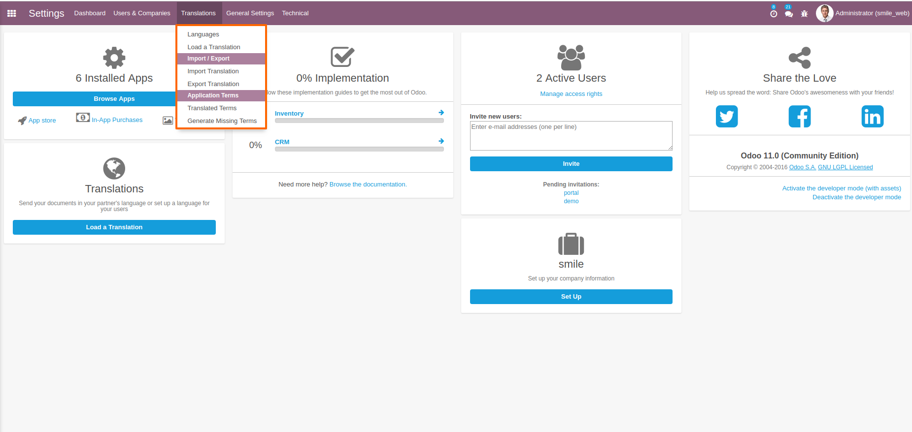
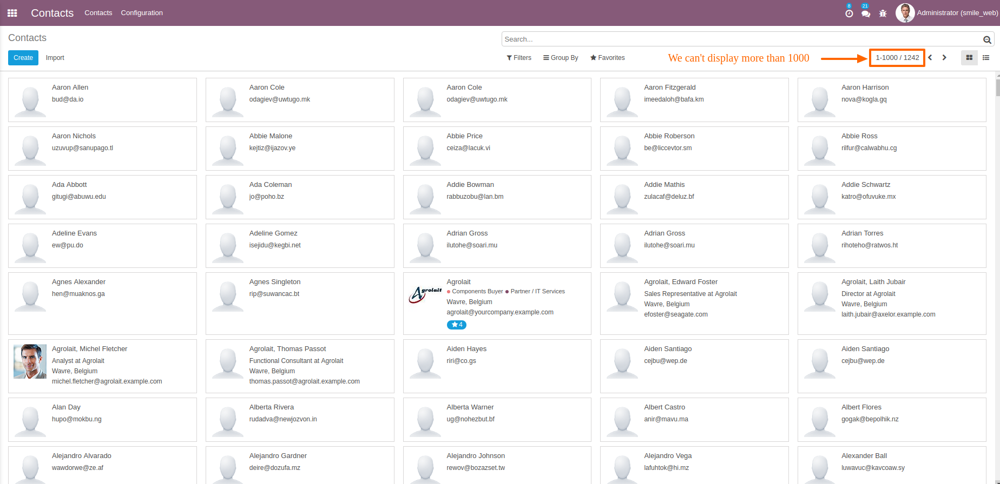
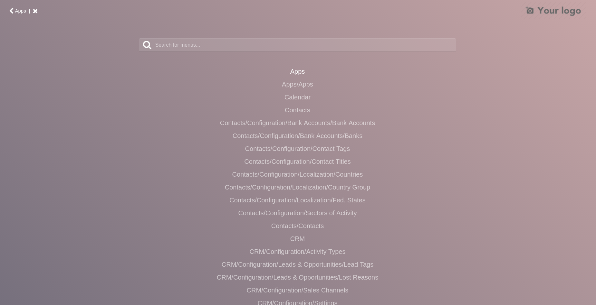

.. image:: https://img.shields.io/badge/licence-GPL--3-blue.svg
    :alt: License: GPL-3

=========================
Smile Web
=========================

.. IMPORTANT::
   This module depends on web_responsive module that developed by OCA, you find a URL to download it, and then add to your addons.

           https://apps.odoo.com/apps/modules/11.0/web_responsive/

Features:

* Make chatter display at right of window
* Hide hidden menus in navbar search provided by module web_responsive
* Add a special case for module base_technical_features, forcing the display of technical menus hidden by default if user hasn't enable debug mode
* Add automatically sheet element in arch to contourn a bug with a chatter at right
* Make a pager limit = 1000, in order to not display more than 1000 record

**Table of contents**

.. contents::
   :local:

Usage
=====

1. Chatter :

2. Hidden menus in navbar :

3. Pager limit :

4. Add Search for menus

Bug Tracker
===========

Bugs are tracked on `GitHub Issues <https://github.com/Smile-SA/odoo_addons/issues>`_.
In case of trouble, please check there if your issue has already been reported.
If you spotted it first, help us smashing it by providing a detailed and welcomed feedback
`here <https://github.com/Smile-SA/odoo_addons/issues/new?body=module:%20smile_audit%0Aversion:%2011.0%0A%0A**Steps%20to%20reproduce**%0A-%20...%0A%0A**Current%20behavior**%0A%0A**Expected%20behavior**>`_.

Do not contact contributors directly about support or help with technical issues.

Credits
=======

Authors
-------

Smile SA

Contributors
------------
Corentin Pouhet-Brunerie

Isabelle Richard

Ismail El Bakkali

Maintainer
----------
This module is maintained by the Smile SA.

Since 1991 Smile has been a pioneer of technology and also the European expert in open source solutions.

.. image:: https://avatars0.githubusercontent.com/u/572339?s=200&v=4
   :alt: Smile SA
   :target: http://smile.fr

This module is part of the `odoo-addons <https://github.com/Smile-SA/odoo_addons>`_ project on GitHub.

You are welcome to contribute.

