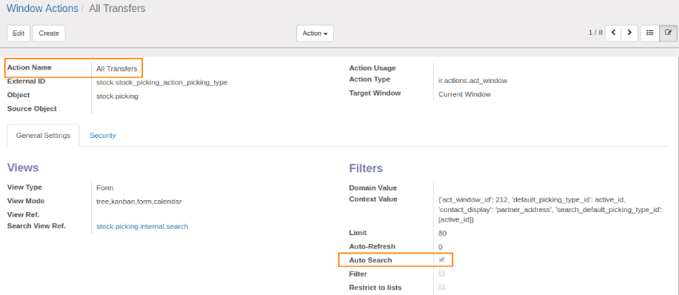
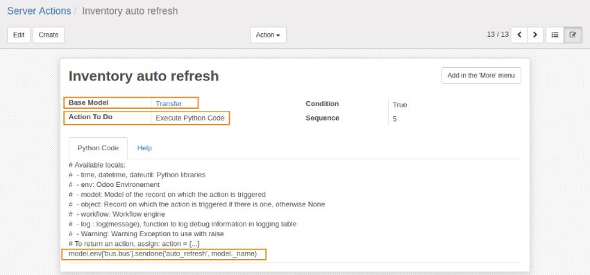
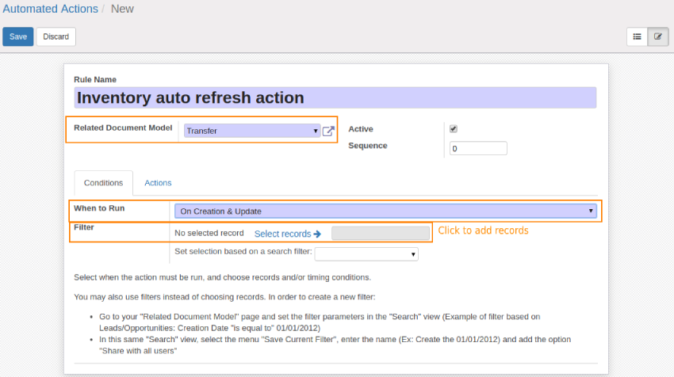
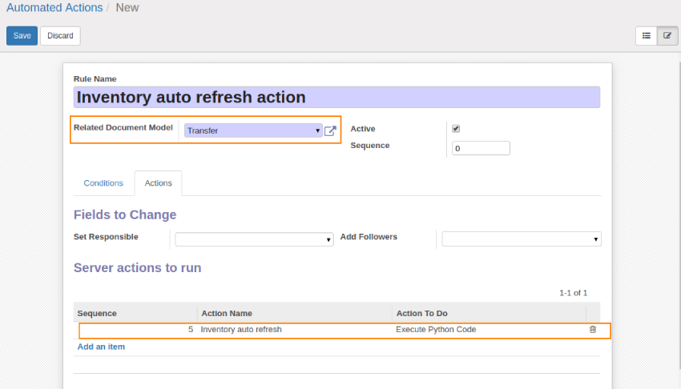

================
Web Auto Refresh
================

.. |badge2| image:: https://img.shields.io/badge/licence-AGPL--3-blue.png
    :target: http://www.gnu.org/licenses/agpl-3.0-standalone.html
    :alt: License: AGPL-3
.. |badge3| image:: https://img.shields.io/badge/github-Smile_SA%2Fodoo_addons-lightgray.png?logo=github
    :target: https://github.com/Smile-SA/odoo_addons/tree/9.0/smile_web_auto_refresh
    :alt: Smile-SA/odoo_addons

|badge2| |badge3|

This module is a fork of web_auto_refresh developped by Fisher Yu on Odoo v10.
This fork works with all non-edited views, not only with kanban and list views.

**Table of contents**

.. contents::
   :local:

Configuration
=============

To configure this module, you need to:

1. Go to ``Setting > Technical > Actions > Window Actions``, find the desired action, activate the auto search Check box.
2. Create a server action for the target model, select "Execute python Code" as an action to do then add the following python code:

    .. code-block:: python

        model.env['bus.bus'].sendone('auto_refresh', model._name)

   This automated action can be applied (when to run) to creation, update or delete per your requirement. It is also possible to force the opening of a page by indicating #action.

    For example: an automatic return to the home page is done by executing the code:

    .. code-block:: python

        model.env ['bus.bus'].sendone ('auto_refresh', '#home')

3. Create an automated action for the same model the add the created server action in "Server actions to run".

Usage
=====
(We will take stock.picking as a example model)

1. Go to ``Settings > Technical > Actions > Window Actions`` and activate the auto search:

2. Go to ``Settings > Technical > actions > Server Actions`` and create the action as follow:

4. Go to ``Settings > Technical > Automation > Automated Actions`` and create an action as follow:

5. Try to edit and update a field in the target model, then save the changes. The module will automatically refresh the record and the changes will appear in the different sessions.

Bug Tracker
===========

Bugs are tracked on `GitHub Issues <https://github.com/Smile-SA/odoo_addons/issues>`_.
In case of trouble, please check there if your issue has already been reported.
If you spotted it first, help us smashing it by providing a detailed and welcomed feedback
`here <https://github.com/Smile-SA/odoo_addons/issues/new?body=module:%20smile_web_auto_refresh%0Aversion:%209.0%0A%0A**Steps%20to%20reproduce**%0A-%20...%0A%0A**Current%20behavior**%0A%0A**Expected%20behavior**>`_.

Do not contact contributors directly about support or help with technical issues.

Credits
=======

Authors
-------

* Corentin POUHET-BRUNERIE
* Majda EL MARIOULI

Maintainer
----------
This module is maintained by the Smile SA.

Since 1991 Smile has been a pioneer of technology and also the European expert in open source solutions.

.. image:: https://avatars0.githubusercontent.com/u/572339?s=200&v=4
   :alt: Smile SA
   :target: http://smile.fr

This module is part of the `odoo-addons <https://github.com/Smile-SA/odoo_addons>`_ project on GitHub.

You are welcome to contribute.

