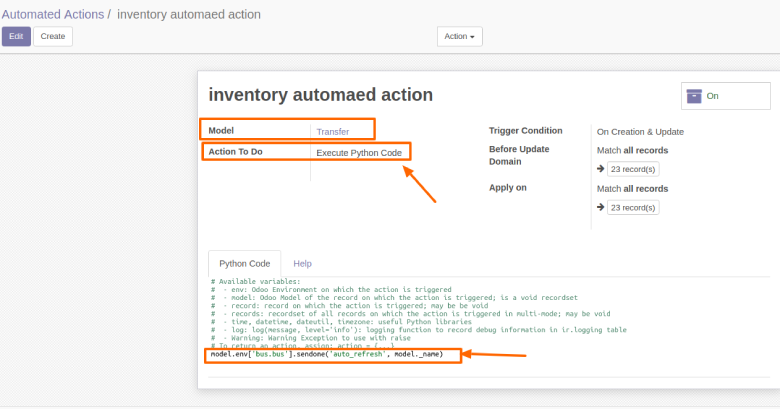
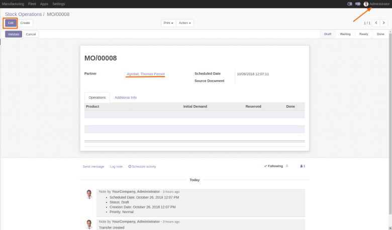
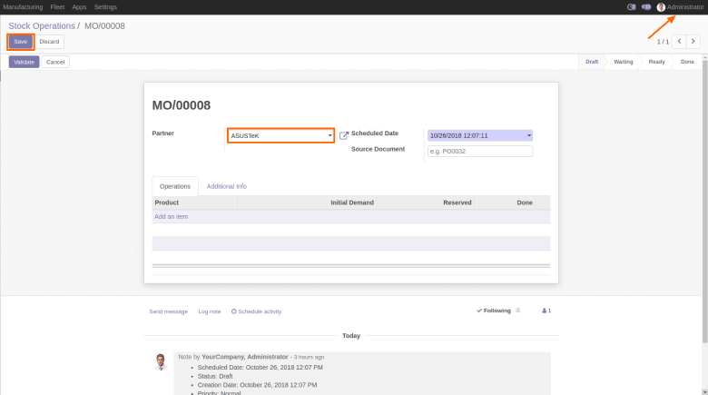
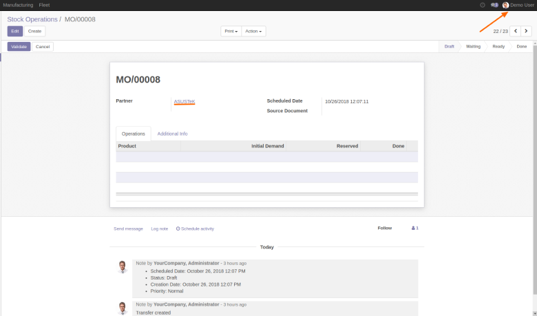

.. image:: https://img.shields.io/badge/licence-AGPL--3-blue.svg
    :alt: License: AGPL-3

================
Web Auto Refresh
================

Features :

This module is a fork of web_auto_refresh developped by Fisher Yu on Odoo v10.
This fork works with all non-edited views, not only with kanban and list views.

To test this module, you need to:

1. Go to Setting > Technical > Actions > Window Actions, find the desired action, activate the auto search Check box
2. Add one automated action for the target model, add the following python code,

    This automated action can be applied(when to run) to creation, update or delete per your requirement
    model.env['bus.bus'].sendone('auto_refresh', model._name)
3. It is also possible to force the opening of a page by indicating #action.

    For example: an automatic return to the home page is done by executing the code: model.env ['bus.bus'].sendone ('auto_refresh', '#home')

**Table of contents**

.. contents::
   :local:

Usage
=====
(We will take stock.picking as a example model)
To activate the auto search :

1. Go to ``Settings > Technical > Actions``> Window Actions menu :

.. figure:: static/description/window_action.png
   :alt: Window Actions
   :width: 100%

To add the automated action for the target model :

2. Go to ``Settings > Technical > automation``> Automated Actions menu :

4. Then the Administrator go to edit a Transfert :

5. In the same time the modification will refresh for the other users :

Bug Tracker
===========

Bugs are tracked on `GitHub Issues <https://github.com/Smile-SA/odoo_addons/issues>`_.
In case of trouble, please check there if your issue has already been reported.
If you spotted it first, help us smashing it by providing a detailed and welcomed feedback
`here <https://github.com/Smile-SA/odoo_addons/issues/new?body=module:%20smile_audit%0Aversion:%2011.0%0A%0A**Steps%20to%20reproduce**%0A-%20...%0A%0A**Current%20behavior**%0A%0A**Expected%20behavior**>`_.

Do not contact contributors directly about support or help with technical issues.

Credits
=======

Authors
-------

Smile SA

Maintainer
----------
This module is maintained by the Smile SA.

Since 1991 Smile has been a pioneer of technology and also the European expert in open source solutions.

.. image:: https://avatars0.githubusercontent.com/u/572339?s=200&v=4
   :alt: Smile SA
   :target: http://smile.fr

This module is part of the `odoo-addons <https://github.com/Smile-SA/odoo_addons>`_ project on GitHub.

You are welcome to contribute.

