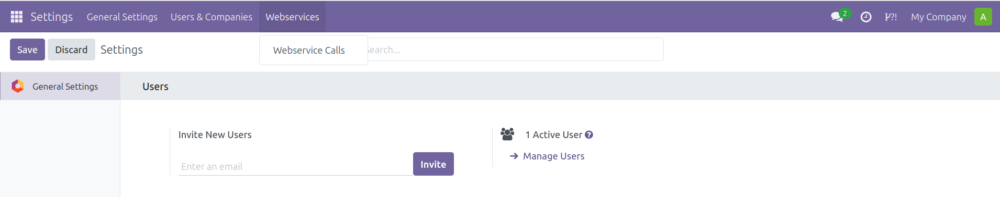
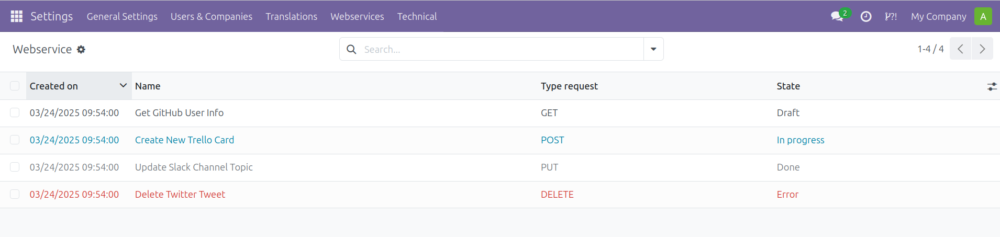
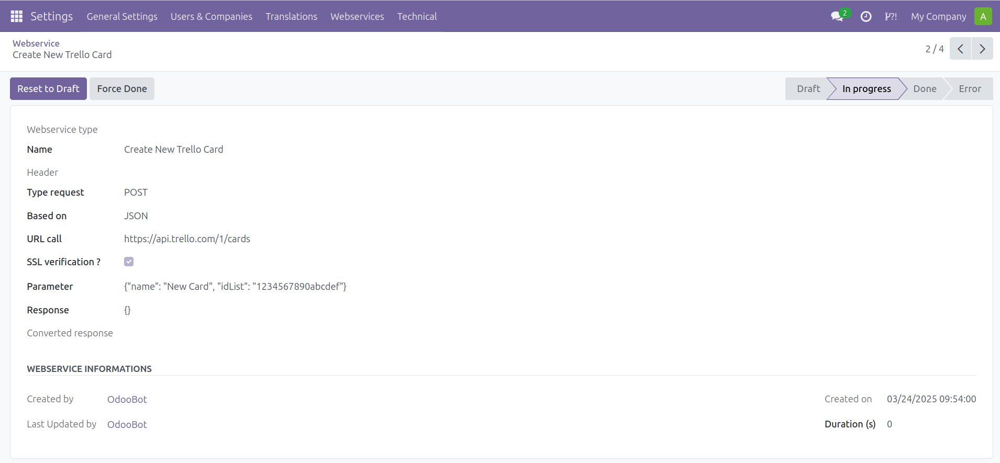

- Go to *Settings > Webservices > Webservice Calls*.

  

- The list shows the most recent calls first. Calls in **Error** are shown in
  red, calls **In progress** in blue, and calls that are **Done** in grey. Use
  the **Draft**, **Done** and **Error** filters, or group calls by **Model**
  (the call name), **Request type** or **Status**. Calls cannot be created or
  edited from the interface.

  

- Open a call to see its details: **Header**, **Type request**, **Based on**,
  **URL call**, **Parameter**, **Response**, **Converted response** and
  **Duration (s)**. For a failed call, the **Webservice errors** section shows
  the **Error code** and the **Error message**.

  

- Use the buttons at the top of the form:
  - **Force call** (Draft) sends the request.
  - **Re-Try** (Error) sends the request again. On success the call becomes
    **Done** and stores the response. If it fails again, it stays in **Error**
    and the new error message is shown.
  - **Reset to Draft** (In progress) unblocks a call that never finished, for
    example after a server crash.
  - **Force Done** (Draft, In progress, Error) marks the call as done without
    sending anything.
