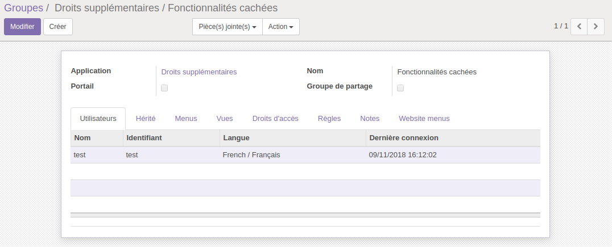
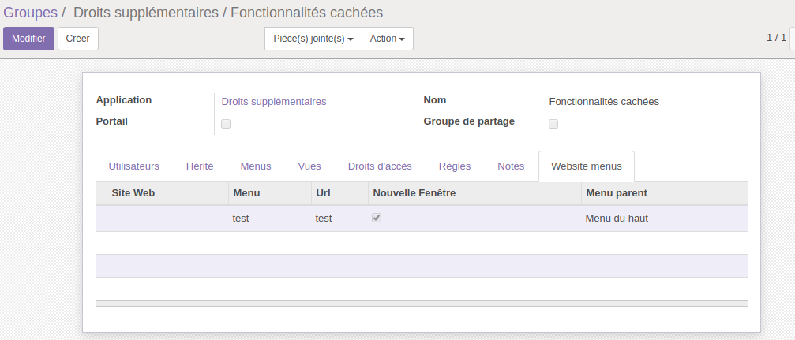
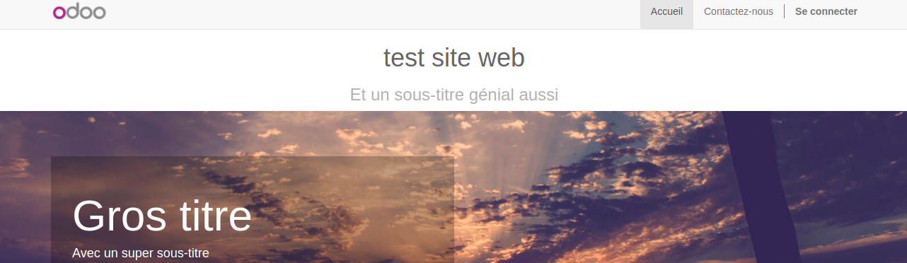
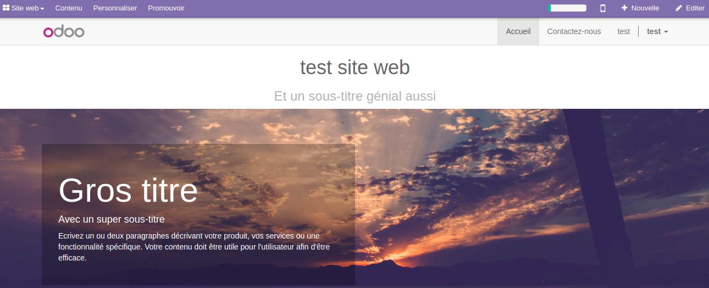

.. |badge1| image:: https://img.shields.io/badge/licence-AGPL--3-blue.svg
    :alt: License: AGPL-3

.. |badge2| image:: https://img.shields.io/badge/github-Smile--SA%2Fodoo_addons-lightgray.png?logo=github
    :target: https://github.com/Smile-SA/odoo_addons/tree/12.0/smile_website_access_control
    :alt: Smile-SA/odoo_addons

|badge1| |badge2|

Website Access Control
=======================

This module is used to hide website menus depending on whether the user
is part of a group or not.

Usage
=====
Once installed, the module creates a list on the groups where you can add
the menus of the website, if the connected user has this group,
he will have access or not to the menu.

Example :

* I create a test web page
* I create a user test with 'Hidden features' group
* Add the webpage 'test' to the group

If I am connected with the user "test" on the website, I have access
to the test menu, but it disappears if I disconnect

Add user to group:

Add menu to group:

Example without user logged in:

Without having the rights on the menu, you can't access it,
even by typing the url directly.

Example with user logged in:

Bug Tracker
===========

Bugs are tracked on `GitHub Issues <https://github.com/Smile-SA/odoo_addons/issues>`_.
In case of trouble, please check there if your issue has already been reported.
If you spotted it first, help us smashing it by providing a detailed and
welcomed feedback
`here <https://github.com/Smile-SA/odoo_addons/issues/new?body=module:%20smile_website_access_control%0Aversion:%2012.0%0A%0A**Steps%20to%20reproduce**%0A-%20...%0A%0A**Current%20behavior**%0A%0A**Expected%20behavior**>`_.

Credits
=======

Contributors
------------

* Corentin POUHET-BRUNERIE

Maintainer
----------

This module is maintained by Smile SA.

Since 1991 Smile has been a pioneer of technology and also the European
expert in open source solutions.
